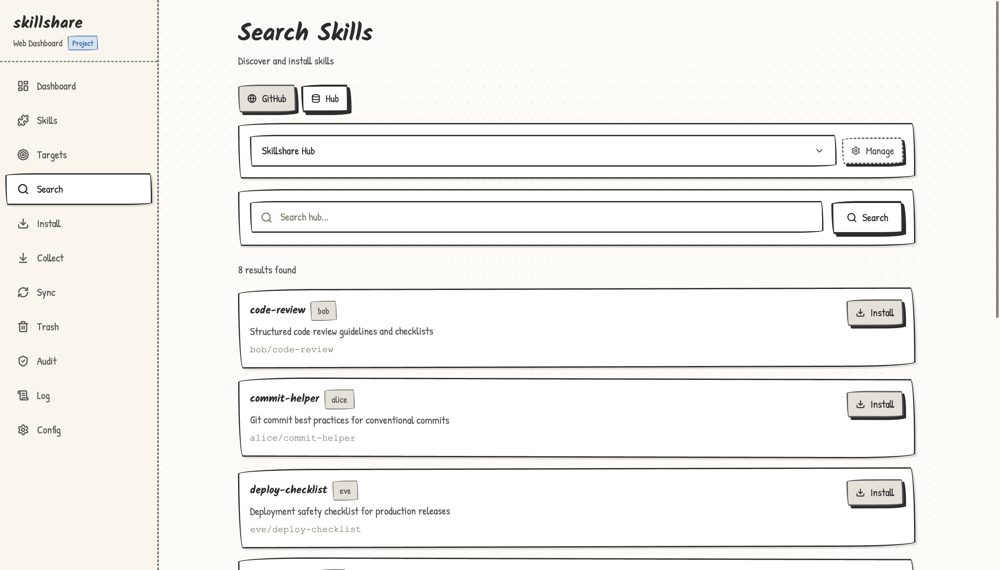

<h1 align="center">skillshare-hub</h1>

<p align="center">
  <strong>Community-curated catalog of <a href="https://github.com/runkids/skillshare">skillshare</a> skills.</strong><br>
  Search, discover, and share AI CLI skills with the community.
</p>

<p align="center">
  <a href="https://github.com/runkids/skillshare-hub/blob/main/skillshare-hub.json"></a>
  <a href="LICENSE"></a>
</p>

## What is this?

A community-maintained index of [skillshare](https://github.com/runkids/skillshare) skills. Anyone can submit their skill via Pull Request — every submission is validated by CI and security-scanned with `skillshare audit`.

**Built into skillshare** — This hub is pre-configured in `skillshare ui`. Just open **Search** > **Hub** and it's ready to use.

## Usage

### Search via CLI

```bash
skillshare search --hub https://raw.githubusercontent.com/runkids/skillshare-hub/main/skillshare-hub.json <query>
```

<p align="center">
  
</p>

### Search via Web UI (built-in)

Run `skillshare ui`, go to **Search** > **Hub** — Skillshare Hub is pre-selected. Browse or search the catalog with one-click install.

<p align="center">
  
</p>

### Install a skill you found

```bash
skillshare install <source>
```

## Share Your Skill

Built a useful skill? Share it with the community! Adding your skill to this hub makes it discoverable by all skillshare users — via CLI, Web UI, or direct install.

### How to Submit

1. Fork this repo
2. Add your skill to `skillshare-hub.json`:
   ```json
   {
     "name": "my-skill",
     "description": "One-line description of what the skill does",
     "source": "your-username/your-repo",
     "tags": ["relevant", "tags"]
   }
   ```
3. Open a Pull Request

CI will automatically:
- Validate JSON format, required fields, and naming conventions
- Clone your skill repo and run `skillshare audit` (security scan)

See [CONTRIBUTING.md](CONTRIBUTING.md) for full guidelines.

## Schema

```json
{
  "schemaVersion": 1,
  "skills": [
    {
      "name": "ascii-box-check",
      "description": "Verify and fix ASCII box-drawing diagram alignment in markdown files",
      "source": "runkids/my-skills",
      "skill": "ascii-box-check",
      "tags": ["docs", "workflow"]
    }
  ]
}
```

| Field | Required | Description |
|-------|----------|-------------|
| `name` | Yes | Unique, lowercase, hyphens only |
| `description` | Yes | One-line description |
| `source` | Yes | GitHub `owner/repo`, full git URL, or any platform URL (GitLab, Bitbucket, etc.) |
| `skill` | No | Specific skill name within a multi-skill repo (used with `install -s`) |
| `tags` | No | 1-3 classification tags |

## Host Your Own Hub

Want to share skills within your team or company? Host your own hub — just serve a `skillshare-hub.json` file anywhere (GitHub repo, internal server, S3, etc.):

```bash
# Auto-generate an index from your skill directory
skillshare hub index --dir ./our-team-skills --output skillshare-hub.json

# Team members search and install from your hub
skillshare search --hub https://your-company.com/skillshare-hub.json
```

Same schema, same CLI, same Web UI — no extra infrastructure needed.

## Documentation

- [skillshare documentation](https://skillshare.runkids.cc/docs) — full CLI reference and guides
- [Hub Index guide](https://skillshare.runkids.cc/docs/hub-index) — create and manage hub indexes
- [CONTRIBUTING.md](CONTRIBUTING.md) — how to submit a skill

## License

[MIT](LICENSE)
