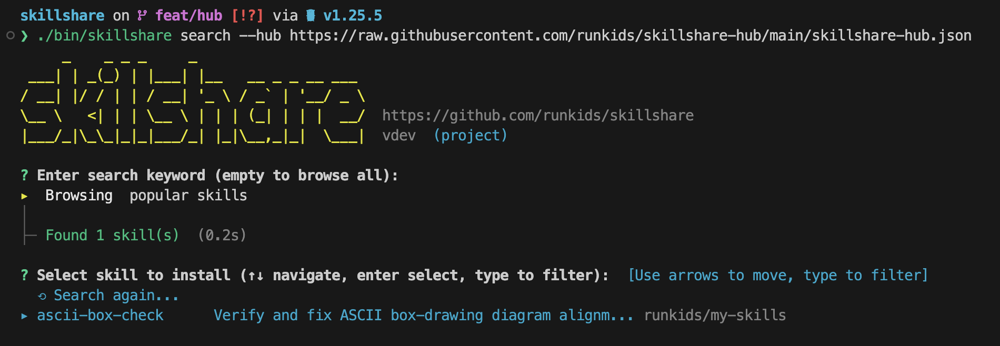
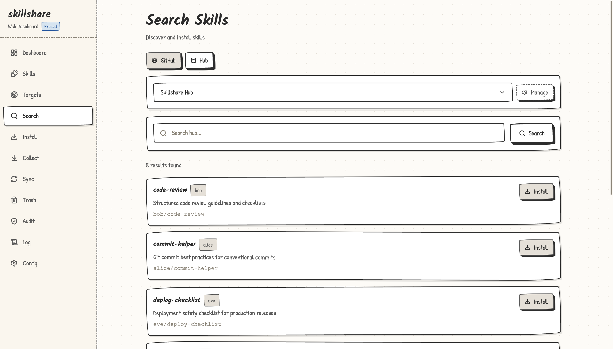

<h1 align="center">skillshare-hub</h1>

<p align="center">
  <strong>A curated catalog of <a href="https://github.com/runkids/skillshare">skillshare</a> skills — and a reference for building your own.</strong><br>
  Search, discover, and install AI CLI skills. Fork this repo to create your organization's internal hub.
</p>

<p align="center">
  <a href="https://github.com/runkids/skillshare-hub/blob/main/skillshare-hub.json"></a>
  <a href="LICENSE"></a>
</p>

## What is this?

A curated index of [skillshare](https://github.com/runkids/skillshare) skills that serves two purposes:

1. **Ready-to-use catalog** — Pre-configured as the default hub in skillshare. Run `skillshare search --hub` or open **Search** > **Hub** in the Web UI.
2. **Reference for your own hub** — Fork this repo, replace the skills with your organization's catalog, and customize the CI pipeline. Same schema, same tooling.

## Usage

### Search via CLI

```bash
skillshare search --hub https://raw.githubusercontent.com/runkids/skillshare-hub/main/skillshare-hub.json <query>
```

<p align="center">
  
</p>

### Search via Web UI (built-in)

Run `skillshare ui`, go to **Search** > **Hub** — Skillshare Hub is pre-selected. Browse or search the catalog with one-click install.

<p align="center">
  
</p>

### Install a skill you found

```bash
skillshare install <source>
```

## Skills Catalog

<!-- CATALOG:START -->
**306 skills** across 11 categories — browse via `skillshare search --hub` or the Web UI

### Frontend (24)

<details>
<summary>Show 24 skills</summary>

- [**accessibility-compliance**](https://github.com/wshobson/agents)  — Web accessibility compliance patterns and WCAG guidelines
- [**angular-component**](https://github.com/analogjs/angular-skills)  — Angular component architecture patterns and best practices
- [**flutter-animations**](https://github.com/madteacher/mad-agents-skills)  — Flutter animation patterns and motion design best practices
- [**flutter-expert**](https://github.com/jeffallan/claude-skills)  — Flutter framework expertise and cross-platform development patterns
- [**javascript-sdk**](https://github.com/inference-sh-9/skills)  — Javascript Sdk skill for AI agent workflows
- [**next-best-practices**](https://github.com/vercel-labs/next-skills)  — Next.js performance optimization and best practices from Vercel
- [**next-cache-components**](https://github.com/vercel-labs/next-skills)  — Next.js caching strategies and optimized component patterns
- [**next-upgrade**](https://github.com/vercel-labs/next-skills)  — Next.js version upgrade guide and migration patterns
- [**nuxt**](https://github.com/antfu/skills)  — Nuxt.js framework best practices and server-side rendering patterns
- [**pinia**](https://github.com/antfu/skills)  — Pinia state management best practices for Vue applications
- [**react-components**](https://github.com/google-labs-code/stitch-skills)  — React component patterns and best practices from Google Labs
- [**react-doctor**](https://github.com/millionco/react-doctor)  — Scans your React codebase for security, performance, correctness, and architecture issues. Outputs a 0-100 score with actionable diagnostics.
- [**react-native-best-practices**](https://github.com/callstackincubator/agent-skills)  — React Native best practices and performance optimization from Callstack
- [**remotion**](https://github.com/google-labs-code/stitch-skills)  — Remotion video creation framework patterns from Google Labs
- [**remotion-render**](https://github.com/inference-sh-6/skills)  — Cloud-based Remotion video rendering via inference.sh
- [**swiftui-expert-skill**](https://github.com/avdlee/swiftui-agent-skill)  — SwiftUI best practices and modern iOS app development patterns
- [**unocss**](https://github.com/antfu/skills)  — UnoCSS atomic CSS engine configuration and utility patterns
- [**upgrading-expo**](https://github.com/expo/skills) — Upgrade Expo SDK versions and resolve dependency compatibility issues
- [**vite**](https://github.com/antfu/skills)  — Vite build tool best practices, configuration, and plugin development
- [**vue**](https://github.com/antfu/skills)  — Vue.js framework best practices and idiomatic patterns from Anthony Fu
- [**vue-best-practices**](https://github.com/hyf0/vue-skills)  — Vue 3 best practices with Composition API, script setup, and TypeScript
- [**vue-debug-guides**](https://github.com/hyf0/vue-skills)  — Vue 3 debugging techniques and error handling patterns
- [**vueuse-functions**](https://github.com/antfu/skills)  — VueUse composable functions and utility patterns for Vue
- [**web-artifacts-builder**](https://github.com/anthropics/skills)  — Build multi-component web artifacts using React, Tailwind, and modern frontend tools

</details>

### Marketing (34)

<details>
<summary>Show 34 skills</summary>

- [**ab-test-setup**](https://github.com/coreyhaines31/marketingskills)  — Set up and run A/B tests for marketing optimization
- [**ai-content-pipeline**](https://github.com/inference-sh-9/skills)  — Ai Content Pipeline skill for AI agent workflows
- [**ai-marketing-videos**](https://github.com/inference-sh-9/skills)  — Ai Marketing Videos skill for AI agent workflows
- [**ai-seo**](https://github.com/coreyhaines31/marketingskills)  — Ai Seo skill for AI agent workflows
- [**ai-social-media-content**](https://github.com/inference-sh-9/skills)  — Ai Social Media Content skill for AI agent workflows
- [**analytics-tracking**](https://github.com/coreyhaines31/marketingskills)  — Set up analytics tracking and measurement plans for marketing
- [**backlink-analyzer**](https://github.com/aaron-he-zhu/seo-geo-claude-skills)  — SEO backlink analysis and link building strategy tool
- [**competitor-alternatives**](https://github.com/coreyhaines31/marketingskills)  — Analyze competitors and craft alternative positioning strategies
- [**content-repurposing**](https://github.com/inference-sh-9/skills)  — Content Repurposing skill for AI agent workflows
- [**content-strategy**](https://github.com/coreyhaines31/marketingskills)  — Develop content marketing strategy and editorial plans
- [**copy-editing**](https://github.com/coreyhaines31/marketingskills)  — Edit and improve marketing copy for clarity and impact
- [**copywriting**](https://github.com/coreyhaines31/marketingskills)  — Write persuasive marketing copy and sales content
- [**email-sequence**](https://github.com/coreyhaines31/marketingskills)  — Design email marketing sequences and drip campaign automations
- [**form-cro**](https://github.com/coreyhaines31/marketingskills)  — Optimize form design and user flow for higher conversion rates
- [**free-tool-strategy**](https://github.com/coreyhaines31/marketingskills)  — Create free tools as marketing lead generation and growth strategy
- [**launch-strategy**](https://github.com/coreyhaines31/marketingskills)  — Plan and execute product launch strategies and go-to-market plans
- [**linkedin-content**](https://github.com/inference-sh-9/skills)  — Linkedin Content skill for AI agent workflows
- [**marketing-ideas**](https://github.com/coreyhaines31/marketingskills)  — Generate creative marketing campaign ideas and growth strategies
- [**marketing-psychology**](https://github.com/coreyhaines31/marketingskills)  — Apply psychological principles to marketing and persuasion strategies
- [**onboarding-cro**](https://github.com/coreyhaines31/marketingskills)  — Optimize user onboarding flows for activation and conversion
- [**page-cro**](https://github.com/coreyhaines31/marketingskills)  — Optimize landing pages for higher conversion rates
- [**paid-ads**](https://github.com/coreyhaines31/marketingskills)  — Create and optimize paid advertising campaigns across platforms
- [**paywall-upgrade-cro**](https://github.com/coreyhaines31/marketingskills)  — Optimize paywall and upgrade prompts for subscription conversion
- [**popup-cro**](https://github.com/coreyhaines31/marketingskills)  — Design and optimize marketing popups for conversion and engagement
- [**pricing-strategy**](https://github.com/coreyhaines31/marketingskills)  — Design and optimize pricing models, tiers, and monetization strategies
- [**product-marketing-context**](https://github.com/coreyhaines31/marketingskills)  — Define product positioning, messaging, and marketing context
- [**programmatic-seo**](https://github.com/coreyhaines31/marketingskills)  — Create programmatic SEO pages at scale for organic traffic growth
- [**referral-program**](https://github.com/coreyhaines31/marketingskills)  — Design and implement customer referral programs for growth
- [**schema-markup**](https://github.com/coreyhaines31/marketingskills)  — Implement structured data and schema markup for better SEO
- [**seo-audit**](https://github.com/coreyhaines31/marketingskills)  — Audit website SEO and provide actionable optimization recommendations
- [**seo-content-brief**](https://github.com/inference-sh-9/skills)  — Seo Content Brief skill for AI agent workflows
- [**seo-geo**](https://github.com/resciencelab/opc-skills)  — Geographic SEO optimization and local search strategies
- [**signup-flow-cro**](https://github.com/coreyhaines31/marketingskills)  — Optimize signup flows and registration for higher conversion
- [**social-content**](https://github.com/coreyhaines31/marketingskills)  — Create engaging social media content and posts across platforms

</details>

### Workflow (110)

<details>
<summary>Show 110 skills</summary>

- [**adapt**](https://github.com/pbakaus/impeccable)  — Adapt skill for AI agent workflows
- [**animate**](https://github.com/pbakaus/impeccable)  — Animate skill for AI agent workflows
- [**antfu**](https://github.com/antfu/skills)  — Anthony Fu's coding conventions and project setup preferences
- [**app-store-screenshots**](https://github.com/inference-sh-9/skills)  — App Store Screenshots skill for AI agent workflows
- [**audit**](https://github.com/pbakaus/impeccable)  — Audit skill for AI agent workflows
- [**azure-quotas**](https://github.com/microsoft/azure-skills)  — Azure Quotas management and best practices
- [**background-removal**](https://github.com/inference-sh-9/skills)  — Background Removal skill for AI agent workflows
- [**bmad-orchestrator**](https://github.com/supercent-io/skills-template)  — Bmad Orchestrator skill for AI agent workflows
- [**bolder**](https://github.com/pbakaus/impeccable)  — Bolder skill for AI agent workflows
- [**brainstorming**](https://github.com/obra/superpowers)  — Structured creative brainstorming and ideation before implementation
- [**case-study-writing**](https://github.com/inference-sh-9/skills)  — Case Study Writing skill for AI agent workflows
- [**chat-ui**](https://github.com/inference-sh-9/skills)  — Chat Ui skill for AI agent workflows
- [**clarify**](https://github.com/pbakaus/impeccable)  — Clarify skill for AI agent workflows
- [**code-refactoring**](https://github.com/supercent-io/skills-template)  — Code Refactoring skill for AI agent workflows
- [**codebase-search**](https://github.com/supercent-io/skills-template)  — Codebase Search skill for AI agent workflows
- [**colorize**](https://github.com/pbakaus/impeccable)  — Colorize skill for AI agent workflows
- [**competitor-teardown**](https://github.com/inference-sh-9/skills)  — Competitor Teardown skill for AI agent workflows
- [**critique**](https://github.com/pbakaus/impeccable)  — Critique skill for AI agent workflows
- [**customer-persona**](https://github.com/inference-sh-9/skills)  — Customer Persona skill for AI agent workflows
- [**data-analysis**](https://github.com/supercent-io/skills-template)  — Data Analysis skill for AI agent workflows
- [**data-visualization**](https://github.com/inference-sh-9/skills)  — Data Visualization skill for AI agent workflows
- [**debugging**](https://github.com/supercent-io/skills-template)  — Debugging skill for AI agent workflows
- [**delight**](https://github.com/pbakaus/impeccable)  — Delight skill for AI agent workflows
- [**dialogue-audio**](https://github.com/inference-sh-9/skills)  — Dialogue Audio skill for AI agent workflows
- [**dispatching-parallel-agents**](https://github.com/obra/superpowers)  — Dispatch and coordinate independent tasks across parallel agents
- [**distill**](https://github.com/pbakaus/impeccable)  — Distill skill for AI agent workflows
- [**executing-plans**](https://github.com/obra/superpowers)  — Execute implementation plans step-by-step with review checkpoints
- [**extract**](https://github.com/pbakaus/impeccable)  — Extract skill for AI agent workflows
- [**file-organization**](https://github.com/supercent-io/skills-template)  — File Organization skill for AI agent workflows
- [**find-skills**](https://github.com/vercel-labs/skills)  — Discover and install skills from the open agent skills ecosystem
- [**finishing-a-development-branch**](https://github.com/obra/superpowers)  — Complete and integrate development branch work with proper review
- [**gemini-computer-use**](https://github.com/am-will/codex-skills)  — Gemini Computer Use skill for AI agent workflows
- [**gh-cli**](https://github.com/github/awesome-copilot)  — Gh Cli skill for AI agent workflows
- [**git-commit**](https://github.com/github/awesome-copilot)  — Git Commit skill for AI agent workflows
- [**git-workflow**](https://github.com/supercent-io/skills-template)  — Git Workflow skill for AI agent workflows
- [**google-veo**](https://github.com/inference-sh-9/skills)  — Google Veo skill for AI agent workflows
- [**grimoire-polymarket**](https://github.com/franalgaba/grimoire)  — Grimoire Polymarket skill for AI agent workflows
- [**harden**](https://github.com/pbakaus/impeccable)  — Harden skill for AI agent workflows
- [**infsh-cli**](https://github.com/inferen-sh/skills)  — Infsh Cli skill for AI agent workflows
- [**log-analysis**](https://github.com/supercent-io/skills-template)  — Log Analysis skill for AI agent workflows
- [**looker-studio-bigquery**](https://github.com/supercent-io/skills-template)  — Looker Studio Bigquery skill for AI agent workflows
- [**markdown-url**](https://github.com/am-will/codex-skills)  — Markdown Url skill for AI agent workflows
- [**monitoring-observability**](https://github.com/supercent-io/skills-template)  — Monitoring Observability skill for AI agent workflows
- [**nano-banana**](https://github.com/inference-sh-9/skills)  — Nano Banana skill for AI agent workflows
- [**nano-banana-2**](https://github.com/inference-sh-9/skills)  — Nano Banana 2 skill for AI agent workflows
- [**newsletter-curation**](https://github.com/inference-sh-9/skills)  — Newsletter Curation skill for AI agent workflows
- [**normalize**](https://github.com/pbakaus/impeccable)  — Normalize skill for AI agent workflows
- [**npm-git-install**](https://github.com/supercent-io/skills-template)  — Npm Git Install skill for AI agent workflows
- [**onboard**](https://github.com/pbakaus/impeccable)  — Onboard skill for AI agent workflows
- [**opencontext**](https://github.com/supercent-io/skills-template)  — Opencontext skill for AI agent workflows
- [**optimize**](https://github.com/pbakaus/impeccable)  — Optimize skill for AI agent workflows
- [**p-video**](https://github.com/inferen-sh/skills)  — P Video skill for AI agent workflows
- [**parallel-task**](https://github.com/am-will/codex-skills)  — Parallel Task skill for AI agent workflows
- [**parallel-task-spark**](https://github.com/am-will/codex-skills)  — Parallel Task Spark skill for AI agent workflows
- [**pattern-detection**](https://github.com/supercent-io/skills-template)  — Pattern Detection skill for AI agent workflows
- [**performance-optimization**](https://github.com/supercent-io/skills-template)  — Performance Optimization skill for AI agent workflows
- [**pitch-deck-visuals**](https://github.com/inference-sh-9/skills)  — Pitch Deck Visuals skill for AI agent workflows
- [**plan-harder**](https://github.com/am-will/codex-skills)  — Plan Harder skill for AI agent workflows
- [**planner**](https://github.com/am-will/codex-skills)  — Planner skill for AI agent workflows
- [**planning-with-files**](https://github.com/othmanadi/planning-with-files)  — File-based planning and task management for AI agent workflows
- [**pnpm**](https://github.com/antfu/skills)  — pnpm package manager best practices and workspace patterns
- [**polish**](https://github.com/pbakaus/impeccable)  — Polish skill for AI agent workflows
- [**press-release-writing**](https://github.com/inference-sh-9/skills)  — Press Release Writing skill for AI agent workflows
- [**product-changelog**](https://github.com/inference-sh-9/skills)  — Product Changelog skill for AI agent workflows
- [**product-hunt-launch**](https://github.com/inference-sh-9/skills)  — Product Hunt Launch skill for AI agent workflows
- [**product-photography**](https://github.com/inference-sh-9/skills)  — Product Photography skill for AI agent workflows
- [**quieter**](https://github.com/pbakaus/impeccable)  — Quieter skill for AI agent workflows
- [**ralph**](https://github.com/supercent-io/skills-template)  — Ralph skill for AI agent workflows
- [**ralph-tui-prd**](https://github.com/subsy/ralph-tui)  — Generate structured product requirements documents for AI agent execution with ralph-tui
- [**read-github**](https://github.com/am-will/codex-skills)  — Read Github skill for AI agent workflows
- [**related-skill**](https://github.com/inference-sh-9/skills)  — Related Skill skill for AI agent workflows
- [**role-creator**](https://github.com/am-will/codex-skills)  — Role Creator skill for AI agent workflows
- [**search**](https://github.com/tavily-ai/skills)  — Search skill for AI agent workflows
- [**simple**](https://github.com/roin-orca/skills)  — Simple skill for AI agent workflows
- [**skill-creator**](https://github.com/anthropics/skills)  — Guide for creating effective skills. This skill should be used when users want to create a new skill (or update an existing skill) that extends Claude's capabilities with specialized knowledge, workflows, or tool integrations.
- [**skill-standardization**](https://github.com/supercent-io/skills-template)  — Skill Standardization skill for AI agent workflows
- [**skillshare**](https://github.com/runkids/skillshare/tree/main/skills/skillshare)  — Built-in AI skill for skillshare – helps install, search, and manage skills from the hub
- [**social-media-carousel**](https://github.com/inference-sh-9/skills)  — Social Media Carousel skill for AI agent workflows
- [**speech-to-text**](https://github.com/inference-sh-9/skills)  — Speech To Text skill for AI agent workflows
- [**standup-meeting**](https://github.com/supercent-io/skills-template)  — Standup Meeting skill for AI agent workflows
- [**state-management**](https://github.com/supercent-io/skills-template)  — State Management skill for AI agent workflows
- [**stitch-loop**](https://github.com/google-labs-code/stitch-skills)  — Iterative design-code loop patterns from Google Labs Stitch
- [**storyboard-creation**](https://github.com/inference-sh-9/skills)  — Storyboard Creation skill for AI agent workflows
- [**subagent-driven-development**](https://github.com/obra/superpowers)  — Execute implementation tasks using coordinated parallel subagents
- [**super-swarm-spark**](https://github.com/am-will/codex-skills)  — Super Swarm Spark skill for AI agent workflows
- [**swarm-planner**](https://github.com/am-will/codex-skills)  — Swarm Planner skill for AI agent workflows
- [**system-environment-setup**](https://github.com/supercent-io/skills-template)  — System Environment Setup skill for AI agent workflows
- [**systematic-debugging**](https://github.com/obra/superpowers)  — Systematic approach to diagnosing and fixing bugs before proposing solutions
- [**talking-head-production**](https://github.com/inference-sh-9/skills)  — Talking Head Production skill for AI agent workflows
- [**task-estimation**](https://github.com/supercent-io/skills-template)  — Task Estimation skill for AI agent workflows
- [**task-planning**](https://github.com/supercent-io/skills-template)  — Task Planning skill for AI agent workflows
- [**teach-impeccable**](https://github.com/pbakaus/impeccable)  — Teach Impeccable skill for AI agent workflows
- [**technical-blog-writing**](https://github.com/inference-sh-9/skills)  — Technical Blog Writing skill for AI agent workflows
- [**technical-writing**](https://github.com/supercent-io/skills-template)  — Technical Writing skill for AI agent workflows
- [**text-to-speech**](https://github.com/inference-sh-9/skills)  — Text To Speech skill for AI agent workflows
- [**tools-ui**](https://github.com/inference-sh-9/skills)  — Tools Ui skill for AI agent workflows
- [**twitter-automation**](https://github.com/inference-sh-9/skills)  — Twitter Automation skill for AI agent workflows
- [**twitter-thread-creation**](https://github.com/inference-sh-9/skills)  — Twitter Thread Creation skill for AI agent workflows
- [**user-guide-writing**](https://github.com/supercent-io/skills-template)  — User Guide Writing skill for AI agent workflows
- [**using-git-worktrees**](https://github.com/obra/superpowers)  — Use git worktrees for isolated feature development without stashing
- [**using-superpowers**](https://github.com/obra/superpowers)  — Discover and use available superpowers skills at conversation start
- [**verification-before-completion**](https://github.com/obra/superpowers)  — Run verification commands before claiming work is complete or fixed
- [**vet**](https://github.com/imbue-ai/vet)  — Vet skill for AI agent workflows
- [**video-ad-specs**](https://github.com/inference-sh-9/skills)  — Video Ad Specs skill for AI agent workflows
- [**web-accessibility**](https://github.com/supercent-io/skills-template)  — Web Accessibility skill for AI agent workflows
- [**web-search**](https://github.com/inference-sh-9/skills)  — Web Search skill for AI agent workflows
- [**widgets-ui**](https://github.com/inference-sh-9/skills)  — Widgets Ui skill for AI agent workflows
- [**workflow-automation**](https://github.com/supercent-io/skills-template)  — Workflow Automation skill for AI agent workflows
- [**writing-plans**](https://github.com/obra/superpowers)  — Create structured, step-by-step implementation plans before writing code
- [**writing-skills**](https://github.com/obra/superpowers)  — Create, edit, and verify skills for AI code agents

</details>

### Agent (61)

<details>
<summary>Show 61 skills</summary>

- [**agent-browser**](https://github.com/vercel-labs/agent-browser)  — Browser automation agent for web page interactions using Playwright
- [**agent-configuration**](https://github.com/supercent-io/skills-template) — Agent Configuration skill for AI agent workflows
- [**agent-email-cli**](https://github.com/zaddy6/agent-email-skill)  — Agent Email Cli skill for AI agent workflows
- [**agent-evaluation**](https://github.com/supercent-io/skills-template) — Agent Evaluation skill for AI agent workflows
- [**agent-tools**](https://github.com/inf-sh/skills)  — Run 150+ AI apps in the cloud via inference.sh CLI — image, video, LLM, search, and more
- [**agent-ui**](https://github.com/inference-sh-9/skills)  — Agent Ui skill for AI agent workflows
- [**agentation**](https://github.com/benjitaylor/agentation)  — Agent coordination framework for multi-agent task execution
- [**agentic-development-principles**](https://github.com/supercent-io/skills-template) — Agentic Development Principles skill for AI agent workflows
- [**agentic-workflow**](https://github.com/supercent-io/skills-template) — Agentic Workflow skill for AI agent workflows
- [**ai-automation-workflows**](https://github.com/inference-sh-9/skills)  — Ai Automation Workflows skill for AI agent workflows
- [**ai-avatar-video**](https://github.com/inference-sh-9/skills)  — Ai Avatar Video skill for AI agent workflows
- [**ai-image-generation**](https://github.com/inference-sh-9/skills)  — Ai Image Generation skill for AI agent workflows
- [**ai-music-generation**](https://github.com/inference-sh-9/skills)  — Ai Music Generation skill for AI agent workflows
- [**ai-podcast-creation**](https://github.com/inference-sh-9/skills)  — Ai Podcast Creation skill for AI agent workflows
- [**ai-product-photography**](https://github.com/inference-sh-9/skills)  — Ai Product Photography skill for AI agent workflows
- [**ai-rag-pipeline**](https://github.com/inference-sh-9/skills)  — Ai Rag Pipeline skill for AI agent workflows
- [**ai-video-generation**](https://github.com/inference-sh-9/skills)  — Ai Video Generation skill for AI agent workflows
- [**ai-voice-cloning**](https://github.com/inference-sh-9/skills)  — Ai Voice Cloning skill for AI agent workflows
- [**baoyu-article-illustrator**](https://github.com/jimliu/baoyu-skills)  — Generate illustrations for articles and blog posts
- [**baoyu-comic**](https://github.com/jimliu/baoyu-skills)  — Create comic strips and visual stories from text prompts
- [**baoyu-compress-image**](https://github.com/jimliu/baoyu-skills)  — Compress and optimize images for web and social media
- [**baoyu-cover-image**](https://github.com/jimliu/baoyu-skills)  — Generate cover images for articles, posts, and social media
- [**baoyu-danger-gemini-web**](https://github.com/jimliu/baoyu-skills)  — Web browsing and research using Gemini API integration
- [**baoyu-danger-x-to-markdown**](https://github.com/jimliu/baoyu-skills)  — Convert X/Twitter posts and threads to Markdown format
- [**baoyu-image-gen**](https://github.com/jimliu/baoyu-skills)  — Generate images from text prompts using AI models
- [**baoyu-infographic**](https://github.com/jimliu/baoyu-skills)  — Create infographic visualizations from data and text
- [**baoyu-post-to-wechat**](https://github.com/jimliu/baoyu-skills)  — Publish and format content for WeChat Official Accounts
- [**baoyu-post-to-x**](https://github.com/jimliu/baoyu-skills)  — Compose and publish posts to X/Twitter with media support
- [**baoyu-slide-deck**](https://github.com/jimliu/baoyu-skills)  — Generate presentation slide decks from text content
- [**baoyu-url-to-markdown**](https://github.com/jimliu/baoyu-skills)  — Convert web page content to clean Markdown format
- [**baoyu-xhs-images**](https://github.com/jimliu/baoyu-skills)  — Create image posts optimized for Xiaohongshu (RED) platform
- [**browser-use**](https://github.com/browser-use/browser-use)  — Browser automation CLI for persistent session-based web interactions
- [**changelog-maintenance**](https://github.com/supercent-io/skills-template)  — Changelog Maintenance skill for AI agent workflows
- [**chatgpt-app-builder**](https://github.com/mcp-use/mcp-use)  — Build ChatGPT-powered applications with MCP integration
- [**clawdirect**](https://github.com/napoleond/clawdirect)  — Directory of social web experiences for AI agents — browse, like, and manage listings
- [**clawdirect-dev**](https://github.com/napoleond/clawdirect)  — Development tools and utilities for ClawDirect directory extensions
- [**cold-email**](https://github.com/coreyhaines31/marketingskills)  — Cold Email skill for AI agent workflows
- [**copilot-coding-agent**](https://github.com/supercent-io/skills-template)  — Copilot Coding Agent skill for AI agent workflows
- [**enhance-prompt**](https://github.com/google-labs-code/stitch-skills)  — AI prompt enhancement and optimization techniques
- [**explainer-video-guide**](https://github.com/inference-sh-9/skills)  — Explainer Video Guide skill for AI agent workflows
- [**firebase-ai-logic**](https://github.com/supercent-io/skills-template)  — Firebase Ai Logic skill for AI agent workflows
- [**flux-image**](https://github.com/inference-sh-9/skills)  — Flux Image skill for AI agent workflows
- [**fun-brainstorming**](https://github.com/roin-orca/skills)  — Fun Brainstorming skill for AI agent workflows
- [**image-to-video**](https://github.com/inference-sh-9/skills)  — Image To Video skill for AI agent workflows
- [**image-upscaling**](https://github.com/inference-sh-9/skills)  — Image Upscaling skill for AI agent workflows
- [**llm-council**](https://github.com/am-will/codex-skills)  — Llm Council skill for AI agent workflows
- [**llm-models**](https://github.com/inference-sh-9/skills)  — Llm Models skill for AI agent workflows
- [**mastra**](https://github.com/mastra-ai/skills)  — Mastra AI agent framework patterns and workflow orchestration
- [**mcp-builder**](https://github.com/anthropics/skills)  — Build Model Context Protocol (MCP) servers and tools for AI agents
- [**openai-docs-skill**](https://github.com/am-will/codex-skills)  — Openai Docs Skill skill for AI agent workflows
- [**p-image**](https://github.com/inferen-sh/skills)  — P Image skill for AI agent workflows
- [**pollinations-ai**](https://github.com/supercent-io/skills-template) — Pollinations Ai skill for AI agent workflows
- [**prompt-engineering**](https://github.com/inference-sh-9/skills)  — Prompt Engineering skill for AI agent workflows
- [**prompt-repetition**](https://github.com/supercent-io/skills-template)  — Prompt Repetition skill for AI agent workflows
- [**qwen-image-2**](https://github.com/toolshell/skills)  — Qwen Image 2 skill for AI agent workflows
- [**qwen-image-2-pro**](https://github.com/toolshell/skills)  — Qwen Image 2 Pro skill for AI agent workflows
- [**release-skills**](https://github.com/jimliu/baoyu-skills)  — Automate release notes and changelog generation
- [**remembering-conversations**](https://github.com/obra/episodic-memory)  — Episodic memory for AI agents to maintain conversation context
- [**seedance2-api**](https://github.com/hexiaochun/seedance2-api) — Seedance2 video generation API integration and workflow
- [**simple-brainstorm**](https://github.com/roin-orca/skills) — Simple Brainstorm skill for AI agent workflows
- [**video-prompting-guide**](https://github.com/inference-sh-9/skills)  — Video Prompting Guide skill for AI agent workflows

</details>

### Design (23)

<details>
<summary>Show 23 skills</summary>

- [**algorithmic-art**](https://github.com/anthropics/skills)  — Generate algorithmic and generative art with code
- [**api-design**](https://github.com/supercent-io/skills-template)  — Api Design skill for AI agent workflows
- [**book-cover-design**](https://github.com/inference-sh-9/skills)  — Book Cover Design skill for AI agent workflows
- [**brand-guidelines**](https://github.com/anthropics/skills)  — Create and maintain brand identity guidelines and visual standards
- [**canvas-design**](https://github.com/anthropics/skills)  — Design and generate HTML canvas-based visuals and interactive graphics
- [**character-design-sheet**](https://github.com/inference-sh-9/skills)  — Character Design Sheet skill for AI agent workflows
- [**database-schema-design**](https://github.com/supercent-io/skills-template)  — Database Schema Design skill for AI agent workflows
- [**design-md**](https://github.com/google-labs-code/stitch-skills)  — Design system documentation and component specification in Markdown
- [**email-design**](https://github.com/inference-sh-9/skills)  — Email Design skill for AI agent workflows
- [**frontend-design**](https://github.com/anthropics/skills)  — Create distinctive, production-grade frontend interfaces with high design quality
- [**interface-design**](https://github.com/dammyjay93/interface-design)  — User interface design principles and interaction patterns
- [**landing-page-design**](https://github.com/inference-sh-9/skills)  — Landing Page Design skill for AI agent workflows
- [**logo-design-guide**](https://github.com/inference-sh-9/skills)  — Logo Design Guide skill for AI agent workflows
- [**og-image-design**](https://github.com/inference-sh-9/skills)  — Og Image Design skill for AI agent workflows
- [**responsive-design**](https://github.com/supercent-io/skills-template)  — Responsive Design skill for AI agent workflows
- [**shadcn**](https://github.com/shadcn/ui)  — Shadcn skill for AI agent workflows
- [**shadcn-ui**](https://github.com/google-labs-code/stitch-skills)  — Shadcn Ui skill for AI agent workflows
- [**slack-gif-creator**](https://github.com/anthropics/skills)  — Create animated GIFs for Slack from text prompts and images
- [**theme-factory**](https://github.com/anthropics/skills)  — Create and customize UI themes, color palettes, and design tokens
- [**ui-component-patterns**](https://github.com/supercent-io/skills-template)  — Ui Component patterns and implementation guidelines
- [**ui-ux-pro-max**](https://github.com/nextlevelbuilder/ui-ux-pro-max-skill)  — UI/UX design intelligence with 50 styles, 21 palettes, 50 font pairings, and 20 chart types
- [**web-design-guidelines**](https://github.com/vercel-labs/agent-skills)  — Review UI code for Web Interface Guidelines compliance and design quality
- [**youtube-thumbnail-design**](https://github.com/inference-sh-9/skills)  — Youtube Thumbnail Design skill for AI agent workflows

</details>

### Docs (10)

<details>
<summary>Show 10 skills</summary>

- [**api-documentation**](https://github.com/supercent-io/skills-template)  — Api Documentation skill for AI agent workflows
- [**context7**](https://github.com/intellectronica/agent-skills)  — Retrieve up-to-date documentation for software libraries by querying the Context7 API
- [**doc-coauthoring**](https://github.com/anthropics/skills)  — Collaborative document writing, editing, and coauthoring
- [**docx**](https://github.com/anthropics/skills)  — Create and edit Word documents programmatically
- [**internal-comms**](https://github.com/anthropics/skills)  — Draft internal communications, announcements, and team updates
- [**obsidian-bases**](https://github.com/kepano/obsidian-skills)  — Obsidian knowledge base patterns and plugin development
- [**pdf**](https://github.com/anthropics/skills)  — Generate and manipulate PDF documents programmatically
- [**pptx**](https://github.com/anthropics/skills)  — Create and edit PowerPoint presentations programmatically
- [**vitepress**](https://github.com/antfu/skills)  — VitePress static site generator configuration and customization
- [**xlsx**](https://github.com/anthropics/skills)  — Create and edit Excel spreadsheets programmatically

</details>

### Testing (8)

<details>
<summary>Show 8 skills</summary>

- [**backend-testing**](https://github.com/supercent-io/skills-template)  — Backend Testing skill for AI agent workflows
- [**code-review**](https://github.com/supercent-io/skills-template)  — Code Review skill for AI agent workflows
- [**receiving-code-review**](https://github.com/obra/superpowers)  — Process and implement code review feedback effectively
- [**requesting-code-review**](https://github.com/obra/superpowers)  — Request and structure code reviews for effective feedback
- [**test-driven-development**](https://github.com/obra/superpowers)  — Enforce test-driven development workflow — write tests first, then implement
- [**testing-strategies**](https://github.com/supercent-io/skills-template)  — Testing Strategies skill for AI agent workflows
- [**vitest**](https://github.com/antfu/skills)  — Vitest testing framework best practices and configuration patterns
- [**webapp-testing**](https://github.com/anthropics/skills)  — End-to-end web application testing with Playwright and modern testing tools

</details>

### Backend (6)

<details>
<summary>Show 6 skills</summary>

- [**convex**](https://github.com/waynesutton/convexskills)  — Convex backend platform patterns and real-time data sync
- [**golang-pro**](https://github.com/jeffallan/claude-skills)  — Go programming best practices, idioms, and performance patterns
- [**laravel-specialist**](https://github.com/jeffallan/claude-skills)  — Laravel PHP framework best practices and application patterns
- [**python-executor**](https://github.com/inference-sh-9/skills)  — Python Executor skill for AI agent workflows
- [**python-sdk**](https://github.com/inference-sh-9/skills)  — Python Sdk skill for AI agent workflows
- [**supabase-postgres-best-practices**](https://github.com/supabase/agent-skills)  — PostgreSQL best practices, query optimization, and security for Supabase

</details>

### DevOps (27)

<details>
<summary>Show 27 skills</summary>

- [**appinsights-instrumentation**](https://github.com/microsoft/github-copilot-for-azure)  — Application Insights instrumentation and telemetry for Azure applications
- [**azure-ai**](https://github.com/microsoft/github-copilot-for-azure)  — Azure AI services integration and management
- [**azure-aigateway**](https://github.com/microsoft/github-copilot-for-azure)  — Azure AI Gateway configuration and API management
- [**azure-cloud-migrate**](https://github.com/microsoft/github-copilot-for-azure)  — Azure Cloud Migrate management and best practices
- [**azure-compliance**](https://github.com/microsoft/github-copilot-for-azure)  — Azure compliance assessment and policy management
- [**azure-compute**](https://github.com/microsoft/github-copilot-for-azure)  — Azure Compute management and best practices
- [**azure-cost-optimization**](https://github.com/microsoft/github-copilot-for-azure)  — Azure cost optimization and spending analysis
- [**azure-deploy**](https://github.com/microsoft/github-copilot-for-azure)  — Azure deployment automation and resource provisioning
- [**azure-diagnostics**](https://github.com/microsoft/github-copilot-for-azure)  — Azure diagnostics and troubleshooting for cloud services
- [**azure-hosted-copilot-sdk**](https://github.com/microsoft/github-copilot-for-azure)  — Azure Hosted Copilot Sdk management and best practices
- [**azure-kusto**](https://github.com/microsoft/github-copilot-for-azure)  — Azure Data Explorer (Kusto) query and analytics
- [**azure-messaging**](https://github.com/microsoft/github-copilot-for-azure)  — Azure messaging services (Service Bus, Event Hubs) patterns
- [**azure-observability**](https://github.com/microsoft/github-copilot-for-azure) — Azure monitoring, logging, and observability best practices
- [**azure-postgres**](https://github.com/microsoft/github-copilot-for-azure) — Azure Database for PostgreSQL management and optimization
- [**azure-prepare**](https://github.com/microsoft/github-copilot-for-azure)  — Azure environment preparation and prerequisite setup
- [**azure-rbac**](https://github.com/microsoft/github-copilot-for-azure)  — Azure role-based access control and identity management
- [**azure-resource-lookup**](https://github.com/microsoft/github-copilot-for-azure)  — Azure resource discovery and inventory management
- [**azure-resource-visualizer**](https://github.com/microsoft/github-copilot-for-azure)  — Azure resource topology visualization and dependency mapping
- [**azure-storage**](https://github.com/microsoft/github-copilot-for-azure)  — Azure Storage services configuration and best practices
- [**azure-validate**](https://github.com/microsoft/github-copilot-for-azure)  — Azure resource validation and configuration verification
- [**deployment-automation**](https://github.com/supercent-io/skills-template)  — Deployment Automation skill for AI agent workflows
- [**docker-expert**](https://github.com/sickn33/antigravity-awesome-skills)  — Docker containerization best practices and multi-stage builds
- [**entra-app-registration**](https://github.com/microsoft/github-copilot-for-azure)  — Microsoft Entra ID app registration and authentication setup
- [**expo-deployment**](https://github.com/expo/skills) — Deploy Expo apps to iOS App Store, Android Play Store, and web hosting
- [**microsoft-foundry**](https://github.com/microsoft/github-copilot-for-azure)  — Microsoft AI Foundry platform integration and management
- [**turborepo**](https://github.com/vercel/turborepo)  — Turborepo monorepo build system configuration and optimization
- [**vercel-deploy**](https://github.com/supercent-io/skills-template)  — Vercel Deploy skill for AI agent workflows

</details>

### Security (3)

<details>
<summary>Show 3 skills</summary>

- [**audit-website**](https://github.com/squirrelscan/skills)  — Security audit and vulnerability scanning for websites
- [**authentication-setup**](https://github.com/supercent-io/skills-template)  — Authentication Setup skill for AI agent workflows
- [**security-best-practices**](https://github.com/supercent-io/skills-template)  — Security best practices and recommended patterns

</details>

<!-- CATALOG:END -->

## Share Your Skill

Built a useful skill? Share it with the community! Adding your skill to this hub makes it discoverable by all skillshare users — via CLI, Web UI, or direct install.

### How to Submit

1. Fork this repo
2. Add your skill entry to the appropriate `skills/*.json` category file:
   ```json
   {
     "name": "my-skill",
     "description": "One-line description of what the skill does",
     "source": "your-username/your-repo",
     "tags": ["relevant", "tags"]
   }
   ```
3. Open a Pull Request

CI will automatically:
- Validate JSON format, required fields, and naming conventions
- Clone your skill repo and run `skillshare audit` (security scan)
- Post audit results as a PR comment

See [CONTRIBUTING.md](CONTRIBUTING.md) for full guidelines.

## Schema

```json
{
  "schemaVersion": 1,
  "skills": [
    {
      "name": "ascii-box-check",
      "description": "Verify and fix ASCII box-drawing diagram alignment in markdown files",
      "source": "runkids/my-skills",
      "skill": "ascii-box-check",
      "tags": ["docs", "workflow"],
      "riskScore": 8,
      "riskLabel": "clean",
      "auditedAt": "2026-02-22T04:00:00Z"
    }
  ]
}
```

| Field | Required | Description |
|-------|----------|-------------|
| `name` | Yes | Unique, lowercase, hyphens only |
| `description` | Yes | One-line description |
| `source` | Yes | GitHub `owner/repo`, full git URL, or any platform URL (GitLab, Bitbucket, etc.) |
| `skill` | No | Specific skill name within a multi-skill repo (used with `install -s`) |
| `tags` | No | 1-3 classification tags |
| `riskScore` | No | Security audit risk score (0 = clean, 100 = critical). Auto-generated by CI. |
| `riskLabel` | No | Risk classification: `clean` / `low` / `medium` / `high` / `critical` |
| `auditedAt` | No | ISO 8601 timestamp of last audit |

## CI Automation

This hub runs three automated workflows:

| Workflow | Trigger | What it does |
|----------|---------|--------------|
| **Validate PR** | Pull request | Validates schema, runs `skillshare audit`, posts results as PR comment |
| **Update Index** | Push to main / weekly | Builds hub JSON, audits all skills, generates README catalog, commits |

## Build Your Organization's Hub

Fork this repo to create an internal hub for your team or company. What you get out of the box:

- **CI validation** — JSON format checks and `skillshare audit` security scans on every PR
- **Audit scores** — Weekly security scans with risk scores written to the hub JSON
- **Contribution workflow** — Fork → add entry → PR, with automated gates

```bash
# 1. Fork this repo and replace skills with your internal sources
#    e.g. "source": "ghe.internal.company.com/platform/ai-skills/code-review"

# 2. Or auto-generate an index from installed skills
skillshare hub index -o ./skillshare-hub.json

# 3. Team members add your hub once
skillshare hub add https://skills.internal.company.com/skillshare-hub.json --label company

# 4. Search and install — only accessible behind VPN
skillshare search --hub company
```

The key advantage: `source` fields can point to **private repos** (GitHub Enterprise, internal GitLab, etc.) that public tools like GitHub Search can never reach. Host the JSON file anywhere — internal Git repo, intranet server, S3, file share.

## Documentation

- [skillshare documentation](https://skillshare.runkids.cc/docs) — full CLI reference and guides
- [Hub Index guide](https://skillshare.runkids.cc/docs/hub-index) — create and manage hub indexes
- [CONTRIBUTING.md](CONTRIBUTING.md) — how to submit a skill

## License

[MIT](LICENSE)
