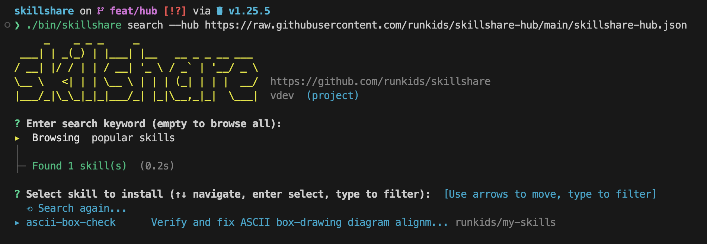
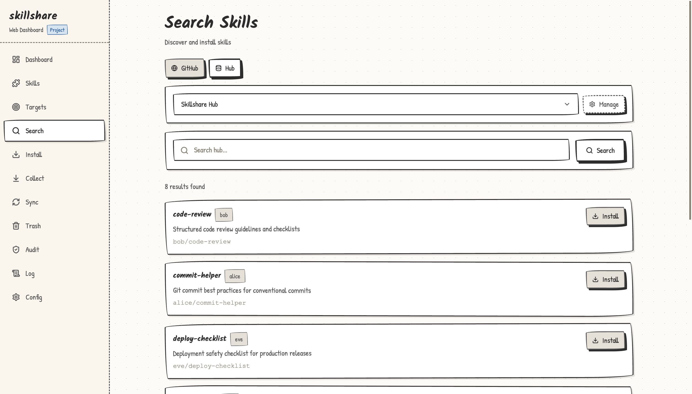

<h1 align="center">skillshare-hub</h1>

<p align="center">
  <strong>A curated catalog of <a href="https://github.com/runkids/skillshare">skillshare</a> skills — and a reference for building your own.</strong><br>
  Search, discover, and install AI CLI skills. Fork this repo to create your organization's internal hub.
</p>

<p align="center">
  <a href="https://github.com/runkids/skillshare-hub/blob/main/skillshare-hub.json"></a>
  <a href="LICENSE"></a>
</p>

## What is this?

A curated index of [skillshare](https://github.com/runkids/skillshare) skills that serves two purposes:

1. **Ready-to-use catalog** — Pre-configured as the default hub in skillshare. Run `skillshare search --hub` or open **Search** > **Hub** in the Web UI.
2. **Reference for your own hub** — Fork this repo, replace the skills with your organization's catalog, and customize the CI pipeline. Same schema, same tooling.

## Usage

### Search via CLI

```bash
skillshare search --hub https://raw.githubusercontent.com/runkids/skillshare-hub/main/skillshare-hub.json <query>
```

<p align="center">
  
</p>

### Search via Web UI (built-in)

Run `skillshare ui`, go to **Search** > **Hub** — Skillshare Hub is pre-selected. Browse or search the catalog with one-click install.

<p align="center">
  
</p>

### Install a skill you found

```bash
skillshare install <source>
```

## Skills Catalog

<!-- CATALOG:START -->
**196 skills** across 11 categories — browse via `skillshare search --hub` or the Web UI

### Frontend (13)

<details>
<summary>Show 13 skills</summary>

- [**accessibility-compliance**](https://github.com/wshobson/agents)  — Web accessibility compliance patterns and WCAG guidelines
- [**next-best-practices**](https://github.com/vercel-labs/next-skills) — Next.js performance optimization and best practices from Vercel
- [**next-cache-components**](https://github.com/vercel-labs/next-skills) — Next.js caching strategies and optimized component patterns
- [**next-upgrade**](https://github.com/vercel-labs/next-skills) — Next.js version upgrade guide and migration patterns
- [**nuxt**](https://github.com/antfu/skills)  — Nuxt.js framework best practices and server-side rendering patterns
- [**pinia**](https://github.com/antfu/skills)  — Pinia state management best practices for Vue applications
- [**react-doctor**](https://github.com/millionco/react-doctor)  — Scans your React codebase for security, performance, correctness, and architecture issues. Outputs a 0-100 score with actionable diagnostics.
- [**unocss**](https://github.com/antfu/skills)  — UnoCSS atomic CSS engine configuration and utility patterns
- [**upgrading-expo**](https://github.com/expo/skills) — Upgrade Expo SDK versions and resolve dependency compatibility issues
- [**vite**](https://github.com/antfu/skills)  — Vite build tool best practices, configuration, and plugin development
- [**vue**](https://github.com/antfu/skills)  — Vue.js framework best practices and idiomatic patterns from Anthony Fu
- [**vueuse-functions**](https://github.com/antfu/skills)  — VueUse composable functions and utility patterns for Vue
- [**web-artifacts-builder**](https://github.com/anthropics/skills)  — Build multi-component web artifacts using React, Tailwind, and modern frontend tools

</details>

### Marketing (25)

<details>
<summary>Show 25 skills</summary>

- [**ab-test-setup**](https://github.com/coreyhaines31/marketingskills) — Set up and run A/B tests for marketing optimization
- [**analytics-tracking**](https://github.com/coreyhaines31/marketingskills) — Set up analytics tracking and measurement plans for marketing
- [**competitor-alternatives**](https://github.com/coreyhaines31/marketingskills) — Analyze competitors and craft alternative positioning strategies
- [**content-strategy**](https://github.com/coreyhaines31/marketingskills)  — Develop content marketing strategy and editorial plans
- [**copy-editing**](https://github.com/coreyhaines31/marketingskills)  — Edit and improve marketing copy for clarity and impact
- [**copywriting**](https://github.com/coreyhaines31/marketingskills)  — Write persuasive marketing copy and sales content
- [**email-sequence**](https://github.com/coreyhaines31/marketingskills) — Design email marketing sequences and drip campaign automations
- [**form-cro**](https://github.com/coreyhaines31/marketingskills) — Optimize form design and user flow for higher conversion rates
- [**free-tool-strategy**](https://github.com/coreyhaines31/marketingskills) — Create free tools as marketing lead generation and growth strategy
- [**launch-strategy**](https://github.com/coreyhaines31/marketingskills) — Plan and execute product launch strategies and go-to-market plans
- [**marketing-ideas**](https://github.com/coreyhaines31/marketingskills)  — Generate creative marketing campaign ideas and growth strategies
- [**marketing-psychology**](https://github.com/coreyhaines31/marketingskills)  — Apply psychological principles to marketing and persuasion strategies
- [**onboarding-cro**](https://github.com/coreyhaines31/marketingskills) — Optimize user onboarding flows for activation and conversion
- [**page-cro**](https://github.com/coreyhaines31/marketingskills) — Optimize landing pages for higher conversion rates
- [**paid-ads**](https://github.com/coreyhaines31/marketingskills) — Create and optimize paid advertising campaigns across platforms
- [**paywall-upgrade-cro**](https://github.com/coreyhaines31/marketingskills) — Optimize paywall and upgrade prompts for subscription conversion
- [**popup-cro**](https://github.com/coreyhaines31/marketingskills) — Design and optimize marketing popups for conversion and engagement
- [**pricing-strategy**](https://github.com/coreyhaines31/marketingskills) — Design and optimize pricing models, tiers, and monetization strategies
- [**product-marketing-context**](https://github.com/coreyhaines31/marketingskills) — Define product positioning, messaging, and marketing context
- [**programmatic-seo**](https://github.com/coreyhaines31/marketingskills)  — Create programmatic SEO pages at scale for organic traffic growth
- [**referral-program**](https://github.com/coreyhaines31/marketingskills) — Design and implement customer referral programs for growth
- [**schema-markup**](https://github.com/coreyhaines31/marketingskills) — Implement structured data and schema markup for better SEO
- [**seo-audit**](https://github.com/coreyhaines31/marketingskills)  — Audit website SEO and provide actionable optimization recommendations
- [**signup-flow-cro**](https://github.com/coreyhaines31/marketingskills) — Optimize signup flows and registration for higher conversion
- [**social-content**](https://github.com/coreyhaines31/marketingskills) — Create engaging social media content and posts across platforms

</details>

### Workflow (76)

<details>
<summary>Show 76 skills</summary>

- [**ace-step**](https://github.com/agentspace-so/runcomfy-agent-skills)  — ace step skill for AI agent workflows
- [**antfu**](https://github.com/antfu/skills)  — Anthony Fu's coding conventions and project setup preferences
- [**azure-enterprise-infra-planner**](https://github.com/microsoft/azure-skills)  — Azure Enterprise Infra Planner management and best practices
- [**azure-quotas**](https://github.com/microsoft/azure-skills)  — Azure Quotas management and best practices
- [**azure-upgrade**](https://github.com/microsoft/azure-skills)  — Azure Upgrade management and best practices
- [**brainstorming**](https://github.com/obra/superpowers)  — Structured creative brainstorming and ideation before implementation
- [**caveman**](https://github.com/juliusbrussee/caveman)  — Caveman skill for AI agent workflows
- [**codex-pet**](https://github.com/agentspace-so/runcomfy-agent-skills)  — Codex Pet skill for AI agent workflows
- [**controlnet-pose**](https://github.com/agentspace-so/runcomfy-agent-skills)  — Controlnet Pose skill for AI agent workflows
- [**dispatching-parallel-agents**](https://github.com/obra/superpowers)  — Dispatch and coordinate independent tasks across parallel agents
- [**elevenlabs-music-generation**](https://github.com/agentspace-so/runcomfy-agent-skills)  — elevenlaus music generation skill for AI agent workflows
- [**executing-plans**](https://github.com/obra/superpowers)  — Execute implementation plans step-by-step with review checkpoints
- [**face-swap**](https://github.com/agentspace-so/runcomfy-agent-skills)  — Face Swap skill for AI agent workflows
- [**find-skills**](https://github.com/vercel-labs/skills)  — Discover and install skills from the open agent skills ecosystem
- [**finishing-a-development-branch**](https://github.com/obra/superpowers)  — Complete and integrate development branch work with proper review
- [**flux-2-klein**](https://github.com/agentspace-so/runcomfy-agent-skills)  — Flux 2 Klein skill for AI agent workflows
- [**flux-kontext**](https://github.com/agentspace-so/runcomfy-agent-skills)  — Flux Kontext skill for AI agent workflows
- [**grill-me**](https://github.com/mattpocock/skills)  — Grill Me skill for AI agent workflows
- [**handoff**](https://github.com/mattpocock/skills)  — handoff skill for AI agent workflows
- [**happyhorse-1-0**](https://github.com/agentspace-so/runcomfy-agent-skills)  — Happyhorse 1 0 skill for AI agent workflows
- [**improve-codebase-architecture**](https://github.com/mattpocock/skills)  — Improve Codebase Architecture skill for AI agent workflows
- [**kling-3-0**](https://github.com/agentspace-so/runcomfy-agent-skills)  — Kling 3 0 skill for AI agent workflows
- [**lark-approval**](https://github.com/larksuite/cli)  — Lark Approval skill for AI agent workflows
- [**lark-attendance**](https://github.com/larksuite/cli)  — Lark Attendance skill for AI agent workflows
- [**lark-base**](https://github.com/larksuite/cli)  — Lark Base skill for AI agent workflows
- [**lark-calendar**](https://github.com/larksuite/cli)  — Lark Calendar skill for AI agent workflows
- [**lark-contact**](https://github.com/larksuite/cli)  — Lark Contact skill for AI agent workflows
- [**lark-drive**](https://github.com/larksuite/cli)  — Lark Drive skill for AI agent workflows
- [**lark-event**](https://github.com/larksuite/cli)  — Lark Event skill for AI agent workflows
- [**lark-im**](https://github.com/larksuite/cli)  — Lark Im skill for AI agent workflows
- [**lark-minutes**](https://github.com/larksuite/cli)  — Lark Minutes skill for AI agent workflows
- [**lark-okr**](https://github.com/larksuite/cli)  — Lark Okr skill for AI agent workflows
- [**lark-openapi-explorer**](https://github.com/larksuite/cli)  — Lark Openapi Explorer skill for AI agent workflows
- [**lark-shared**](https://github.com/larksuite/cli)  — Lark Shared skill for AI agent workflows
- [**lark-sheets**](https://github.com/larksuite/cli)  — Lark Sheets skill for AI agent workflows
- [**lark-skill-maker**](https://github.com/larksuite/cli)  — Lark Skill Maker skill for AI agent workflows
- [**lark-task**](https://github.com/larksuite/cli)  — Lark Task skill for AI agent workflows
- [**lark-vc**](https://github.com/larksuite/cli)  — Lark Vc skill for AI agent workflows
- [**lark-whiteboard**](https://github.com/larksuite/cli)  — Lark Whiteboard skill for AI agent workflows
- [**lark-wiki**](https://github.com/larksuite/cli)  — Lark Wiki skill for AI agent workflows
- [**lark-workflow-meeting-summary**](https://github.com/larksuite/cli)  — Lark Workflow Meeting Summary skill for AI agent workflows
- [**lark-workflow-standup-report**](https://github.com/larksuite/cli)  — Lark Workflow Standup Report skill for AI agent workflows
- [**lipsync**](https://github.com/agentspace-so/runcomfy-agent-skills)  — Lipsync skill for AI agent workflows
- [**nano-banana-2**](https://github.com/inference-sh-9/skills)  — Nano Banana 2 skill for AI agent workflows
- [**nano-banana-edit**](https://github.com/agentspace-so/runcomfy-agent-skills)  — Nano Banana Edit skill for AI agent workflows
- [**openclaw-secure-linux-cloud**](https://github.com/xixu-me/skills)  — Openclaw Secure Linux Cloud skill for AI agent workflows
- [**opensource-guide-coach**](https://github.com/xixu-me/skills)  — Opensource Guide Coach skill for AI agent workflows
- [**pnpm**](https://github.com/antfu/skills)  — pnpm package manager best practices and workspace patterns
- [**prototype**](https://github.com/mattpocock/skills)  — prototype skill for AI agent workflows
- [**readme-i18n**](https://github.com/xixu-me/skills)  — Readme I18n skill for AI agent workflows
- [**relight**](https://github.com/agentspace-so/runcomfy-agent-skills)  — relight skill for AI agent workflows
- [**remotion-render**](https://github.com/halt-catch-fire/skills)  — Remotion Render skill for AI agent workflows
- [**runcomfy-cli**](https://github.com/agentspace-so/runcomfy-agent-skills)  — Runcomfy Cli skill for AI agent workflows
- [**secure-linux-web-hosting**](https://github.com/xixu-me/skills)  — Secure Linux Web Hosting skill for AI agent workflows
- [**seedance-v2**](https://github.com/agentspace-so/runcomfy-agent-skills)  — Seedance V2 skill for AI agent workflows
- [**setup-matt-pocock-skills**](https://github.com/mattpocock/skills)  — Setup Matt Pocock Skills skill for AI agent workflows
- [**skill-creator**](https://github.com/anthropics/skills)  — Guide for creating effective skills. This skill should be used when users want to create a new skill (or update an existing skill) that extends Claude's capabilities with specialized knowledge, workflows, or tool integrations.
- [**skills-cli**](https://github.com/xixu-me/skills)  — Skills Cli skill for AI agent workflows
- [**subagent-driven-development**](https://github.com/obra/superpowers)  — Execute implementation tasks using coordinated parallel subagents
- [**systematic-debugging**](https://github.com/obra/superpowers)  — Systematic approach to diagnosing and fixing bugs before proposing solutions
- [**to-issues**](https://github.com/mattpocock/skills)  — To Issues skill for AI agent workflows
- [**to-prd**](https://github.com/mattpocock/skills)  — To Prd skill for AI agent workflows
- [**triage**](https://github.com/mattpocock/skills)  — Triage skill for AI agent workflows
- [**twitter-automation**](https://github.com/halt-catch-fire/skills)  — Twitter Automation skill for AI agent workflows
- [**tzst**](https://github.com/xixu-me/skills)  — Tzst skill for AI agent workflows
- [**use-my-browser**](https://github.com/xixu-me/skills)  — Use My Browser skill for AI agent workflows
- [**using-git-worktrees**](https://github.com/obra/superpowers)  — Use git worktrees for isolated feature development without stashing
- [**using-superpowers**](https://github.com/obra/superpowers)  — Discover and use available superpowers skills at conversation start
- [**verification-before-completion**](https://github.com/obra/superpowers)  — Run verification commands before claiming work is complete or fixed
- [**video-edit**](https://github.com/agentspace-so/runcomfy-agent-skills)  — Video Edit skill for AI agent workflows
- [**video-extend**](https://github.com/agentspace-so/runcomfy-agent-skills)  — Video Extend skill for AI agent workflows
- [**wan-2-7**](https://github.com/agentspace-so/runcomfy-agent-skills)  — Wan 2 7 skill for AI agent workflows
- [**writing-plans**](https://github.com/obra/superpowers)  — Create structured, step-by-step implementation plans before writing code
- [**writing-skills**](https://github.com/obra/superpowers)  — Create, edit, and verify skills for AI code agents
- [**xdrop**](https://github.com/xixu-me/skills)  — Xdrop skill for AI agent workflows
- [**xget**](https://github.com/xixu-me/skills)  — Xget skill for AI agent workflows

</details>

### Agent (32)

<details>
<summary>Show 32 skills</summary>

- [**agent-browser**](https://github.com/vercel-labs/agent-browser)  — Browser automation agent for web page interactions using Playwright
- [**agentspace**](https://github.com/agentspace-so/skills)  — Agentspace skill for AI agent workflows
- [**ai-avatar-video**](https://github.com/inference-sh-9/skills)  — Ai Avatar Video skill for AI agent workflows
- [**ai-image-generation**](https://github.com/inference-sh-9/skills)  — Ai Image Generation skill for AI agent workflows
- [**ai-music**](https://github.com/agentspace-so/runcomfy-agent-skills)  — Ai Music skill for AI agent workflows
- [**ai-video-generation**](https://github.com/inference-sh-9/skills)  — Ai Video Generation skill for AI agent workflows
- [**baoyu-article-illustrator**](https://github.com/jimliu/baoyu-skills)  — Generate illustrations for articles and blog posts
- [**baoyu-comic**](https://github.com/jimliu/baoyu-skills)  — Create comic strips and visual stories from text prompts
- [**baoyu-compress-image**](https://github.com/jimliu/baoyu-skills)  — Compress and optimize images for web and social media
- [**baoyu-cover-image**](https://github.com/jimliu/baoyu-skills)  — Generate cover images for articles, posts, and social media
- [**baoyu-danger-gemini-web**](https://github.com/jimliu/baoyu-skills)  — Web browsing and research using Gemini API integration
- [**baoyu-danger-x-to-markdown**](https://github.com/jimliu/baoyu-skills)  — Convert X/Twitter posts and threads to Markdown format
- [**baoyu-image-gen**](https://github.com/jimliu/baoyu-skills)  — Generate images from text prompts using AI models
- [**baoyu-infographic**](https://github.com/jimliu/baoyu-skills)  — Create infographic visualizations from data and text
- [**baoyu-post-to-wechat**](https://github.com/jimliu/baoyu-skills)  — Publish and format content for WeChat Official Accounts
- [**baoyu-post-to-x**](https://github.com/jimliu/baoyu-skills)  — Compose and publish posts to X/Twitter with media support
- [**baoyu-slide-deck**](https://github.com/jimliu/baoyu-skills)  — Generate presentation slide decks from text content
- [**baoyu-url-to-markdown**](https://github.com/jimliu/baoyu-skills)  — Convert web page content to clean Markdown format
- [**baoyu-xhs-images**](https://github.com/jimliu/baoyu-skills)  — Create image posts optimized for Xiaohongshu (RED) platform
- [**gpt-image-2**](https://github.com/agentspace-so/agent-skills)  — Gpt Image 2 skill for AI agent workflows
- [**gpt-image-edit**](https://github.com/agentspace-so/runcomfy-agent-skills)  — Gpt Image Edit skill for AI agent workflows
- [**image-edit**](https://github.com/agentspace-so/runcomfy-agent-skills)  — Image Edit skill for AI agent workflows
- [**image-inpainting**](https://github.com/agentspace-so/runcomfy-agent-skills)  — Image Inpainting skill for AI agent workflows
- [**image-outpainting**](https://github.com/agentspace-so/runcomfy-agent-skills)  — Image Outpainting skill for AI agent workflows
- [**image-to-video**](https://github.com/inference-sh-9/skills)  — Image To Video skill for AI agent workflows
- [**lark-mail**](https://github.com/larksuite/cli)  — Lark Mail skill for AI agent workflows
- [**lark-slides**](https://github.com/larksuite/cli)  — Lark Slides skill for AI agent workflows
- [**mcp-builder**](https://github.com/anthropics/skills)  — Build Model Context Protocol (MCP) servers and tools for AI agents
- [**release-skills**](https://github.com/jimliu/baoyu-skills)  — Automate release notes and changelog generation
- [**running-claude-code-via-litellm-copilot**](https://github.com/xixu-me/skills)  — Running Claude Code Via Litellm Copilot skill for AI agent workflows
- [**video-inpainting**](https://github.com/agentspace-so/runcomfy-agent-skills)  — Video Inpainting skill for AI agent workflows
- [**video-outpainting**](https://github.com/agentspace-so/runcomfy-agent-skills)  — Video Outpainting skill for AI agent workflows

</details>

### Design (8)

<details>
<summary>Show 8 skills</summary>

- [**algorithmic-art**](https://github.com/anthropics/skills)  — Generate algorithmic and generative art with code
- [**brand-guidelines**](https://github.com/anthropics/skills)  — Create and maintain brand identity guidelines and visual standards
- [**canvas-design**](https://github.com/anthropics/skills)  — Design and generate HTML canvas-based visuals and interactive graphics
- [**frontend-design**](https://github.com/anthropics/skills)  — Create distinctive, production-grade frontend interfaces with high design quality
- [**slack-gif-creator**](https://github.com/anthropics/skills)  — Create animated GIFs for Slack from text prompts and images
- [**theme-factory**](https://github.com/anthropics/skills)  — Create and customize UI themes, color palettes, and design tokens
- [**ui-ux-pro-max**](https://github.com/nextlevelbuilder/ui-ux-pro-max-skill)  — UI/UX design intelligence with 50 styles, 21 palettes, 50 font pairings, and 20 chart types
- [**web-design-guidelines**](https://github.com/vercel-labs/agent-skills)  — Review UI code for Web Interface Guidelines compliance and design quality

</details>

### Docs (9)

<details>
<summary>Show 9 skills</summary>

- [**doc-coauthoring**](https://github.com/anthropics/skills)  — Collaborative document writing, editing, and coauthoring
- [**docx**](https://github.com/anthropics/skills)  — Create and edit Word documents programmatically
- [**grill-with-docs**](https://github.com/mattpocock/skills)  — Grill With Docs skill for AI agent workflows
- [**internal-comms**](https://github.com/anthropics/skills)  — Draft internal communications, announcements, and team updates
- [**lark-doc**](https://github.com/larksuite/cli)  — Lark Doc skill for AI agent workflows
- [**pdf**](https://github.com/anthropics/skills)  — Generate and manipulate PDF documents programmatically
- [**pptx**](https://github.com/anthropics/skills)  — Create and edit PowerPoint presentations programmatically
- [**vitepress**](https://github.com/antfu/skills)  — VitePress static site generator configuration and customization
- [**xlsx**](https://github.com/anthropics/skills)  — Create and edit Excel spreadsheets programmatically

</details>

### Testing (6)

<details>
<summary>Show 6 skills</summary>

- [**receiving-code-review**](https://github.com/obra/superpowers)  — Process and implement code review feedback effectively
- [**requesting-code-review**](https://github.com/obra/superpowers)  — Request and structure code reviews for effective feedback
- [**tdd**](https://github.com/mattpocock/skills)  — Tdd skill for AI agent workflows
- [**test-driven-development**](https://github.com/obra/superpowers)  — Enforce test-driven development workflow — write tests first, then implement
- [**vitest**](https://github.com/antfu/skills)  — Vitest testing framework best practices and configuration patterns
- [**webapp-testing**](https://github.com/anthropics/skills)  — End-to-end web application testing with Playwright and modern testing tools

</details>

### Backend (1)

<details>
<summary>Show 1 skills</summary>

- [**supabase-postgres-best-practices**](https://github.com/supabase/agent-skills)  — PostgreSQL best practices, query optimization, and security for Supabase

</details>

### DevOps (26)

<details>
<summary>Show 26 skills</summary>

- [**appinsights-instrumentation**](https://github.com/microsoft/github-copilot-for-azure)  — Application Insights instrumentation and telemetry for Azure applications
- [**azure-ai**](https://github.com/microsoft/github-copilot-for-azure)  — Azure AI services integration and management
- [**azure-aigateway**](https://github.com/microsoft/github-copilot-for-azure)  — Azure AI Gateway configuration and API management
- [**azure-cloud-migrate**](https://github.com/microsoft/github-copilot-for-azure)  — Azure Cloud Migrate management and best practices
- [**azure-compliance**](https://github.com/microsoft/github-copilot-for-azure)  — Azure compliance assessment and policy management
- [**azure-compute**](https://github.com/microsoft/github-copilot-for-azure)  — Azure Compute management and best practices
- [**azure-cost-optimization**](https://github.com/microsoft/github-copilot-for-azure) — Azure cost optimization and spending analysis
- [**azure-deploy**](https://github.com/microsoft/github-copilot-for-azure)  — Azure deployment automation and resource provisioning
- [**azure-diagnostics**](https://github.com/microsoft/github-copilot-for-azure)  — Azure diagnostics and troubleshooting for cloud services
- [**azure-hosted-copilot-sdk**](https://github.com/microsoft/github-copilot-for-azure)  — Azure Hosted Copilot Sdk management and best practices
- [**azure-kubernetes**](https://github.com/microsoft/azure-skills)  — Azure Kubernetes management and best practices
- [**azure-kusto**](https://github.com/microsoft/github-copilot-for-azure)  — Azure Data Explorer (Kusto) query and analytics
- [**azure-messaging**](https://github.com/microsoft/github-copilot-for-azure)  — Azure messaging services (Service Bus, Event Hubs) patterns
- [**azure-observability**](https://github.com/microsoft/github-copilot-for-azure) — Azure monitoring, logging, and observability best practices
- [**azure-postgres**](https://github.com/microsoft/github-copilot-for-azure) — Azure Database for PostgreSQL management and optimization
- [**azure-prepare**](https://github.com/microsoft/github-copilot-for-azure)  — Azure environment preparation and prerequisite setup
- [**azure-rbac**](https://github.com/microsoft/github-copilot-for-azure)  — Azure role-based access control and identity management
- [**azure-resource-lookup**](https://github.com/microsoft/github-copilot-for-azure)  — Azure resource discovery and inventory management
- [**azure-resource-visualizer**](https://github.com/microsoft/github-copilot-for-azure)  — Azure resource topology visualization and dependency mapping
- [**azure-storage**](https://github.com/microsoft/github-copilot-for-azure)  — Azure Storage services configuration and best practices
- [**azure-validate**](https://github.com/microsoft/github-copilot-for-azure)  — Azure resource validation and configuration verification
- [**entra-app-registration**](https://github.com/microsoft/github-copilot-for-azure)  — Microsoft Entra ID app registration and authentication setup
- [**expo-deployment**](https://github.com/expo/skills) — Deploy Expo apps to iOS App Store, Android Play Store, and web hosting
- [**github-actions-docs**](https://github.com/xixu-me/skills)  — Github Actions Docs skill for AI agent workflows
- [**microsoft-foundry**](https://github.com/microsoft/github-copilot-for-azure)  — Microsoft AI Foundry platform integration and management
- [**turborepo**](https://github.com/vercel/turborepo)  — Turborepo monorepo build system configuration and optimization

</details>

<!-- CATALOG:END -->

## Share Your Skill

Built a useful skill? Share it with the community! Adding your skill to this hub makes it discoverable by all skillshare users — via CLI, Web UI, or direct install.

### How to Submit

1. Fork this repo
2. Add your skill entry to the appropriate `skills/*.json` category file:
   ```json
   {
     "name": "my-skill",
     "description": "One-line description of what the skill does",
     "source": "your-username/your-repo",
     "tags": ["relevant", "tags"]
   }
   ```
3. Open a Pull Request

CI will automatically:
- Validate JSON format, required fields, and naming conventions
- Clone your skill repo and run `skillshare audit` (security scan)
- Post audit results as a PR comment

See [CONTRIBUTING.md](CONTRIBUTING.md) for full guidelines.

## Schema

```json
{
  "schemaVersion": 1,
  "skills": [
    {
      "name": "ascii-box-check",
      "description": "Verify and fix ASCII box-drawing diagram alignment in markdown files",
      "source": "runkids/my-skills",
      "skill": "ascii-box-check",
      "tags": ["docs", "workflow"],
      "riskScore": 8,
      "riskLabel": "clean",
      "auditedAt": "2026-02-22T04:00:00Z"
    }
  ]
}
```

| Field | Required | Description |
|-------|----------|-------------|
| `name` | Yes | Unique, lowercase, hyphens only |
| `description` | Yes | One-line description |
| `source` | Yes | GitHub `owner/repo`, full git URL, or any platform URL (GitLab, Bitbucket, etc.) |
| `skill` | No | Specific skill name within a multi-skill repo (used with `install -s`) |
| `tags` | No | 1-3 classification tags |
| `riskScore` | No | Security audit risk score (0 = clean, 100 = critical). Auto-generated by CI. |
| `riskLabel` | No | Risk classification: `clean` / `low` / `medium` / `high` / `critical` |
| `auditedAt` | No | ISO 8601 timestamp of last audit |

## CI Automation

This hub runs three automated workflows:

| Workflow | Trigger | What it does |
|----------|---------|--------------|
| **Validate PR** | Pull request | Validates schema, runs `skillshare audit`, posts results as PR comment |
| **Update Index** | Push to main / weekly | Builds hub JSON, audits all skills, generates README catalog, commits |

## Build Your Organization's Hub

Fork this repo to create an internal hub for your team or company. What you get out of the box:

- **CI validation** — JSON format checks and `skillshare audit` security scans on every PR
- **Audit scores** — Weekly security scans with risk scores written to the hub JSON
- **Contribution workflow** — Fork → add entry → PR, with automated gates

```bash
# 1. Fork this repo and replace skills with your internal sources
#    e.g. "source": "ghe.internal.company.com/platform/ai-skills/code-review"

# 2. Or auto-generate an index from installed skills
skillshare hub index -o ./skillshare-hub.json

# 3. Team members add your hub once
skillshare hub add https://skills.internal.company.com/skillshare-hub.json --label company

# 4. Search and install — only accessible behind VPN
skillshare search --hub company
```

The key advantage: `source` fields can point to **private repos** (GitHub Enterprise, internal GitLab, etc.) that public tools like GitHub Search can never reach. Host the JSON file anywhere — internal Git repo, intranet server, S3, file share.

## Documentation

- [skillshare documentation](https://skillshare.runkids.cc/docs) — full CLI reference and guides
- [Hub Index guide](https://skillshare.runkids.cc/docs/hub-index) — create and manage hub indexes
- [CONTRIBUTING.md](CONTRIBUTING.md) — how to submit a skill

## License

[MIT](LICENSE)
