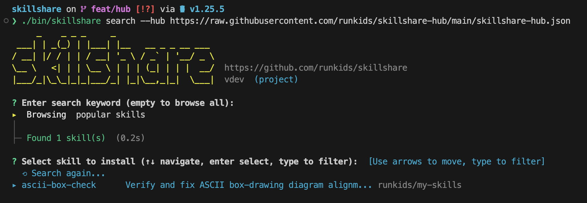
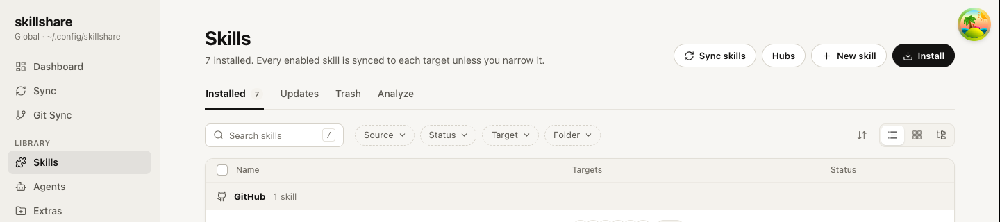
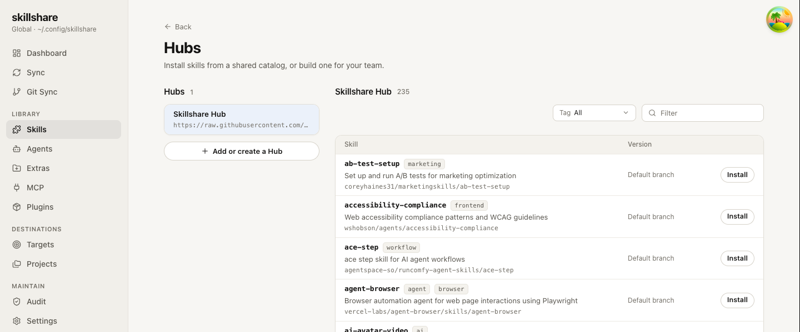
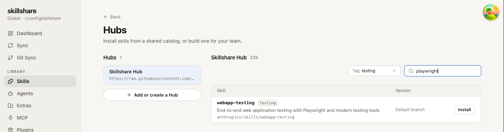
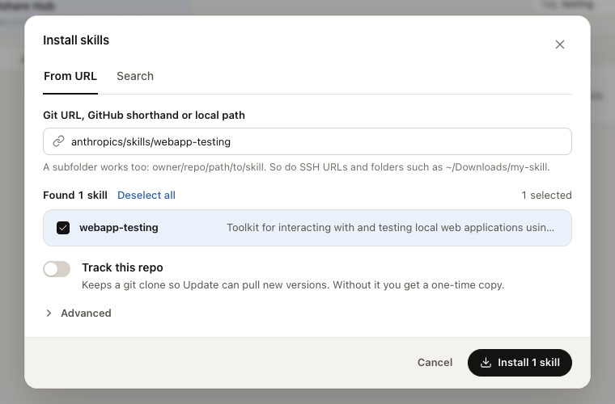
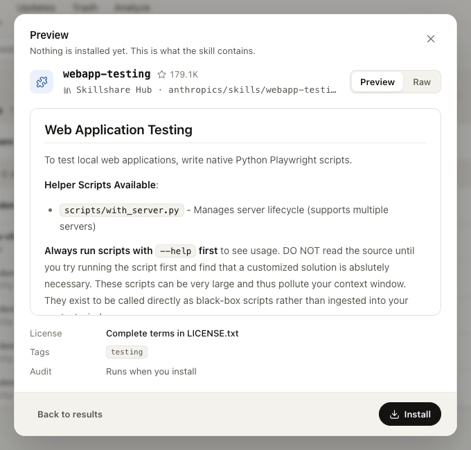
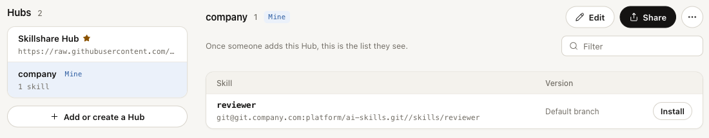
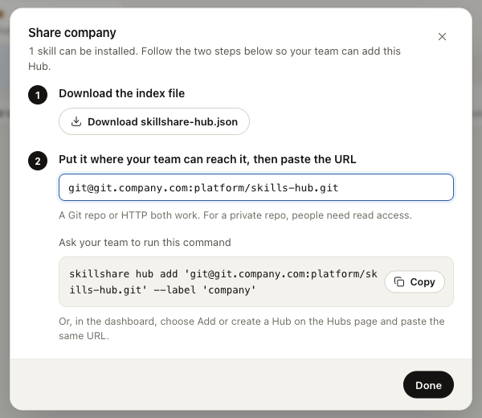
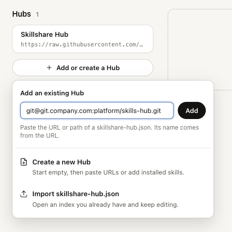

<h1 align="center">skillshare-hub</h1>

<p align="center">
  <strong>A curated catalog of <a href="https://github.com/runkids/skillshare">skillshare</a> skills — and a reference for building your own.</strong><br>
  Search, discover, and install AI CLI skills. Fork this repo to create your organization's internal hub.
</p>

<p align="center">
  <a href="https://github.com/runkids/skillshare-hub/blob/main/skillshare-hub.json"></a>
  <a href="LICENSE"></a>
</p>

## What is this?

A curated index of [skillshare](https://github.com/runkids/skillshare) skills that serves two purposes:

1. **Ready-to-use catalog** — Pre-configured as the default hub in skillshare. Run `skillshare search --hub` or open **Skills** > **Hubs** in the Web UI.
2. **Reference for your own hub** — Fork this repo, replace the skills with your organization's catalog, and customize the CI pipeline. Same schema, same tooling.

## Usage

### Search via CLI

```bash
skillshare search --hub https://raw.githubusercontent.com/runkids/skillshare-hub/main/skillshare-hub.json <query>
```

<p align="center">
  
</p>

### Search via Web UI (built-in)

**1. Open the Hubs page.** Run `skillshare ui`, open **Skills** in the sidebar, then click **Hubs**.

<p align="center">
  
</p>

**2. Pick Skillshare Hub.** It is built in, so it is always in the **Hubs** list. Click it to load the whole catalog.

<p align="center">
  
</p>

**3. Narrow the list.** Choose a **Tag** (for example `testing`) and type a word into **Filter**.

<p align="center">
  
</p>

**4. Install.** Click **Install** on a row. The **Install skills** dialog opens with the source filled in: click **Find skills**, keep the skill checked, then click **Install 1 skill**. Every skill is audited before it is installed, and the row then shows **Installed**.

<p align="center">
  
</p>

**5. Preview before installing (optional).** On the Skills page, click **Install**, open the **Search** tab, set **In** to **Skillshare Hub**, and click a result. **Preview** shows the skill's content, license and tags without installing anything.

<p align="center">
  
</p>

To use another hub, click **Add or create a Hub** on the Hubs page, paste the URL of its `skillshare-hub.json` under **Add an existing Hub**, and click **Add**.

### Install a skill you found

```bash
skillshare install <source>
```

## Skills Catalog

<!-- CATALOG:START -->
**235 skills** across 11 categories — browse via `skillshare search --hub` or the Web UI

### Frontend (13)

<details>
<summary>Show 13 skills</summary>

- [**accessibility-compliance**](https://github.com/wshobson/agents)  — Web accessibility compliance patterns and WCAG guidelines
- [**next-best-practices**](https://github.com/vercel-labs/next-skills) — Next.js performance optimization and best practices from Vercel
- [**next-cache-components**](https://github.com/vercel-labs/next-skills) — Next.js caching strategies and optimized component patterns
- [**next-upgrade**](https://github.com/vercel-labs/next-skills) — Next.js version upgrade guide and migration patterns
- [**nuxt**](https://github.com/antfu/skills)  — Nuxt.js framework best practices and server-side rendering patterns
- [**pinia**](https://github.com/antfu/skills)  — Pinia state management best practices for Vue applications
- [**react-doctor**](https://github.com/millionco/react-doctor)  — Scans your React codebase for security, performance, correctness, and architecture issues. Outputs a 0-100 score with actionable diagnostics.
- [**unocss**](https://github.com/antfu/skills)  — UnoCSS atomic CSS engine configuration and utility patterns
- [**upgrading-expo**](https://github.com/expo/skills) — Upgrade Expo SDK versions and resolve dependency compatibility issues
- [**vite**](https://github.com/antfu/skills)  — Vite build tool best practices, configuration, and plugin development
- [**vue**](https://github.com/antfu/skills)  — Vue.js framework best practices and idiomatic patterns from Anthony Fu
- [**vueuse-functions**](https://github.com/antfu/skills) — VueUse composable functions and utility patterns for Vue
- [**web-artifacts-builder**](https://github.com/anthropics/skills)  — Build multi-component web artifacts using React, Tailwind, and modern frontend tools

</details>

### Marketing (25)

<details>
<summary>Show 25 skills</summary>

- [**ab-test-setup**](https://github.com/coreyhaines31/marketingskills) — Set up and run A/B tests for marketing optimization
- [**analytics-tracking**](https://github.com/coreyhaines31/marketingskills) — Set up analytics tracking and measurement plans for marketing
- [**competitor-alternatives**](https://github.com/coreyhaines31/marketingskills) — Analyze competitors and craft alternative positioning strategies
- [**content-strategy**](https://github.com/coreyhaines31/marketingskills)  — Develop content marketing strategy and editorial plans
- [**copy-editing**](https://github.com/coreyhaines31/marketingskills)  — Edit and improve marketing copy for clarity and impact
- [**copywriting**](https://github.com/coreyhaines31/marketingskills)  — Write persuasive marketing copy and sales content
- [**email-sequence**](https://github.com/coreyhaines31/marketingskills) — Design email marketing sequences and drip campaign automations
- [**form-cro**](https://github.com/coreyhaines31/marketingskills) — Optimize form design and user flow for higher conversion rates
- [**free-tool-strategy**](https://github.com/coreyhaines31/marketingskills) — Create free tools as marketing lead generation and growth strategy
- [**launch-strategy**](https://github.com/coreyhaines31/marketingskills) — Plan and execute product launch strategies and go-to-market plans
- [**marketing-ideas**](https://github.com/coreyhaines31/marketingskills)  — Generate creative marketing campaign ideas and growth strategies
- [**marketing-psychology**](https://github.com/coreyhaines31/marketingskills)  — Apply psychological principles to marketing and persuasion strategies
- [**onboarding-cro**](https://github.com/coreyhaines31/marketingskills) — Optimize user onboarding flows for activation and conversion
- [**page-cro**](https://github.com/coreyhaines31/marketingskills) — Optimize landing pages for higher conversion rates
- [**paid-ads**](https://github.com/coreyhaines31/marketingskills) — Create and optimize paid advertising campaigns across platforms
- [**paywall-upgrade-cro**](https://github.com/coreyhaines31/marketingskills) — Optimize paywall and upgrade prompts for subscription conversion
- [**popup-cro**](https://github.com/coreyhaines31/marketingskills) — Design and optimize marketing popups for conversion and engagement
- [**pricing-strategy**](https://github.com/coreyhaines31/marketingskills) — Design and optimize pricing models, tiers, and monetization strategies
- [**product-marketing-context**](https://github.com/coreyhaines31/marketingskills) — Define product positioning, messaging, and marketing context
- [**programmatic-seo**](https://github.com/coreyhaines31/marketingskills)  — Create programmatic SEO pages at scale for organic traffic growth
- [**referral-program**](https://github.com/coreyhaines31/marketingskills) — Design and implement customer referral programs for growth
- [**schema-markup**](https://github.com/coreyhaines31/marketingskills) — Implement structured data and schema markup for better SEO
- [**seo-audit**](https://github.com/coreyhaines31/marketingskills)  — Audit website SEO and provide actionable optimization recommendations
- [**signup-flow-cro**](https://github.com/coreyhaines31/marketingskills) — Optimize signup flows and registration for higher conversion
- [**social-content**](https://github.com/coreyhaines31/marketingskills) — Create engaging social media content and posts across platforms

</details>

### Workflow (105)

<details>
<summary>Show 105 skills</summary>

- [**ace-step**](https://github.com/agentspace-so/runcomfy-agent-skills)  — ace step skill for AI agent workflows
- [**antfu**](https://github.com/antfu/skills)  — Anthony Fu's coding conventions and project setup preferences
- [**ask-matt**](https://github.com/mattpocock/skills)  — Ask Matt skill for AI agent workflows
- [**azure-cost**](https://github.com/microsoft/azure-skills) — Azure Cost management and best practices
- [**azure-enterprise-infra-planner**](https://github.com/microsoft/azure-skills)  — Azure Enterprise Infra Planner management and best practices
- [**azure-quotas**](https://github.com/microsoft/azure-skills)  — Azure Quotas management and best practices
- [**azure-upgrade**](https://github.com/microsoft/azure-skills)  — Azure Upgrade management and best practices
- [**brainstorming**](https://github.com/obra/superpowers)  — Structured creative brainstorming and ideation before implementation
- [**caveman**](https://github.com/juliusbrussee/caveman)  — Caveman skill for AI agent workflows
- [**caveman-commit**](https://github.com/juliusbrussee/caveman)  — Caveman Commit skill for AI agent workflows
- [**caveman-compress**](https://github.com/juliusbrussee/caveman)  — Caveman Compress skill for AI agent workflows
- [**caveman-help**](https://github.com/juliusbrussee/caveman)  — Caveman Help skill for AI agent workflows
- [**caveman-review**](https://github.com/juliusbrussee/caveman)  — Caveman Review skill for AI agent workflows
- [**codex-pet**](https://github.com/agentspace-so/runcomfy-agent-skills)  — Codex Pet skill for AI agent workflows
- [**controlnet-pose**](https://github.com/agentspace-so/runcomfy-agent-skills)  — Controlnet Pose skill for AI agent workflows
- [**diagnosing-bugs**](https://github.com/mattpocock/skills)  — Diagnosing Bugs skill for AI agent workflows
- [**dispatching-parallel-agents**](https://github.com/obra/superpowers)  — Dispatch and coordinate independent tasks across parallel agents
- [**elevenlabs-music-generation**](https://github.com/agentspace-so/runcomfy-agent-skills)  — elevenlaus music generation skill for AI agent workflows
- [**env-and-assets-bootstrap**](https://github.com/lllllllama/rigorpilot-skills)  — Env And Assets Bootstrap skill for AI agent workflows
- [**executing-plans**](https://github.com/obra/superpowers)  — Execute implementation plans step-by-step with review checkpoints
- [**face-swap**](https://github.com/agentspace-so/runcomfy-agent-skills)  — Face Swap skill for AI agent workflows
- [**find-skills**](https://github.com/vercel-labs/skills)  — Discover and install skills from the open agent skills ecosystem
- [**finishing-a-development-branch**](https://github.com/obra/superpowers)  — Complete and integrate development branch work with proper review
- [**flux-2-klein**](https://github.com/agentspace-so/runcomfy-agent-skills)  — Flux 2 Klein skill for AI agent workflows
- [**flux-kontext**](https://github.com/agentspace-so/runcomfy-agent-skills)  — Flux Kontext skill for AI agent workflows
- [**general-video**](https://github.com/heygen-com/hyperframes)  — General Video skill for AI agent workflows
- [**grill-me**](https://github.com/mattpocock/skills)  — Grill Me skill for AI agent workflows
- [**grilling**](https://github.com/mattpocock/skills)  — Grilling skill for AI agent workflows
- [**handoff**](https://github.com/mattpocock/skills)  — handoff skill for AI agent workflows
- [**happyhorse-1-0**](https://github.com/agentspace-so/runcomfy-agent-skills)  — Happyhorse 1 0 skill for AI agent workflows
- [**hyperframes**](https://github.com/heygen-com/hyperframes)  — Hyperframes skill for AI agent workflows
- [**hyperframes-animation**](https://github.com/heygen-com/hyperframes)  — Hyperframes Animation skill for AI agent workflows
- [**hyperframes-cli**](https://github.com/heygen-com/hyperframes)  — Hyperframes Cli skill for AI agent workflows
- [**hyperframes-core**](https://github.com/heygen-com/hyperframes)  — Hyperframes Core skill for AI agent workflows
- [**hyperframes-creative**](https://github.com/heygen-com/hyperframes)  — Hyperframes Creative skill for AI agent workflows
- [**hyperframes-keyframes**](https://github.com/heygen-com/hyperframes)  — Hyperframes Keyframes skill for AI agent workflows
- [**hyperframes-registry**](https://github.com/heygen-com/hyperframes)  — Hyperframes Registry skill for AI agent workflows
- [**implement**](https://github.com/mattpocock/skills)  — Implement skill for AI agent workflows
- [**improve-codebase-architecture**](https://github.com/mattpocock/skills)  — Improve Codebase Architecture skill for AI agent workflows
- [**kling-3-0**](https://github.com/agentspace-so/runcomfy-agent-skills)  — Kling 3 0 skill for AI agent workflows
- [**lark-approval**](https://github.com/larksuite/cli)  — Lark Approval skill for AI agent workflows
- [**lark-attendance**](https://github.com/larksuite/cli)  — Lark Attendance skill for AI agent workflows
- [**lark-base**](https://github.com/larksuite/cli)  — Lark Base skill for AI agent workflows
- [**lark-calendar**](https://github.com/larksuite/cli)  — Lark Calendar skill for AI agent workflows
- [**lark-contact**](https://github.com/larksuite/cli)  — Lark Contact skill for AI agent workflows
- [**lark-drive**](https://github.com/larksuite/cli)  — Lark Drive skill for AI agent workflows
- [**lark-event**](https://github.com/larksuite/cli)  — Lark Event skill for AI agent workflows
- [**lark-im**](https://github.com/larksuite/cli)  — Lark Im skill for AI agent workflows
- [**lark-minutes**](https://github.com/larksuite/cli)  — Lark Minutes skill for AI agent workflows
- [**lark-okr**](https://github.com/larksuite/cli)  — Lark Okr skill for AI agent workflows
- [**lark-openapi-explorer**](https://github.com/larksuite/cli)  — Lark Openapi Explorer skill for AI agent workflows
- [**lark-shared**](https://github.com/larksuite/cli)  — Lark Shared skill for AI agent workflows
- [**lark-sheets**](https://github.com/larksuite/cli)  — Lark Sheets skill for AI agent workflows
- [**lark-skill-maker**](https://github.com/larksuite/cli)  — Lark Skill Maker skill for AI agent workflows
- [**lark-task**](https://github.com/larksuite/cli)  — Lark Task skill for AI agent workflows
- [**lark-vc**](https://github.com/larksuite/cli)  — Lark Vc skill for AI agent workflows
- [**lark-whiteboard**](https://github.com/larksuite/cli)  — Lark Whiteboard skill for AI agent workflows
- [**lark-wiki**](https://github.com/larksuite/cli)  — Lark Wiki skill for AI agent workflows
- [**lark-workflow-meeting-summary**](https://github.com/larksuite/cli)  — Lark Workflow Meeting Summary skill for AI agent workflows
- [**lark-workflow-standup-report**](https://github.com/larksuite/cli)  — Lark Workflow Standup Report skill for AI agent workflows
- [**lipsync**](https://github.com/agentspace-so/runcomfy-agent-skills)  — Lipsync skill for AI agent workflows
- [**loop-me**](https://github.com/mattpocock/skills)  — Loop Me skill for AI agent workflows
- [**media-use**](https://github.com/heygen-com/hyperframes)  — Media Use skill for AI agent workflows
- [**migrate-to-shoehorn**](https://github.com/mattpocock/skills)  — Migrate To Shoehorn skill for AI agent workflows
- [**minimal-run-and-audit**](https://github.com/lllllllama/rigorpilot-skills)  — Minimal Run And Audit skill for AI agent workflows
- [**nano-banana-2**](https://github.com/inference-sh-9/skills)  — Nano Banana 2 skill for AI agent workflows
- [**nano-banana-edit**](https://github.com/agentspace-so/runcomfy-agent-skills)  — Nano Banana Edit skill for AI agent workflows
- [**paper-context-resolver**](https://github.com/lllllllama/rigorpilot-skills)  — Paper Context Resolver skill for AI agent workflows
- [**pnpm**](https://github.com/antfu/skills)  — pnpm package manager best practices and workspace patterns
- [**prototype**](https://github.com/mattpocock/skills)  — prototype skill for AI agent workflows
- [**reddit-automation**](https://github.com/flowkit-labs/skills)  — Reddit Automation skill for AI agent workflows
- [**relight**](https://github.com/agentspace-so/runcomfy-agent-skills)  — relight skill for AI agent workflows
- [**remotion-best-practices**](https://github.com/remotion-dev/skills)  — Remotion best practices and recommended patterns
- [**repo-intake-and-plan**](https://github.com/lllllllama/rigorpilot-skills)  — Repo Intake And Plan skill for AI agent workflows
- [**research**](https://github.com/mattpocock/skills)  — Research skill for AI agent workflows
- [**resolving-merge-conflicts**](https://github.com/mattpocock/skills)  — Resolving Merge Conflicts skill for AI agent workflows
- [**runcomfy-cli**](https://github.com/agentspace-so/runcomfy-agent-skills)  — Runcomfy Cli skill for AI agent workflows
- [**scaffold-exercises**](https://github.com/mattpocock/skills)  — Scaffold Exercises skill for AI agent workflows
- [**seedance-v2**](https://github.com/agentspace-so/runcomfy-agent-skills)  — Seedance V2 skill for AI agent workflows
- [**setup-matt-pocock-skills**](https://github.com/mattpocock/skills)  — Setup Matt Pocock Skills skill for AI agent workflows
- [**setup-pre-commit**](https://github.com/mattpocock/skills)  — Setup Pre Commit skill for AI agent workflows
- [**skill-creator**](https://github.com/anthropics/skills)  — Guide for creating effective skills. This skill should be used when users want to create a new skill (or update an existing skill) that extends Claude's capabilities with specialized knowledge, workflows, or tool integrations.
- [**subagent-driven-development**](https://github.com/obra/superpowers)  — Execute implementation tasks using coordinated parallel subagents
- [**systematic-debugging**](https://github.com/obra/superpowers)  — Systematic approach to diagnosing and fixing bugs before proposing solutions
- [**teach**](https://github.com/mattpocock/skills)  — Teach skill for AI agent workflows
- [**to-issues**](https://github.com/mattpocock/skills) — To Issues skill for AI agent workflows
- [**to-prd**](https://github.com/mattpocock/skills) — To Prd skill for AI agent workflows
- [**to-spec**](https://github.com/mattpocock/skills)  — To Spec skill for AI agent workflows
- [**to-tickets**](https://github.com/mattpocock/skills)  — To Tickets skill for AI agent workflows
- [**triage**](https://github.com/mattpocock/skills)  — Triage skill for AI agent workflows
- [**twitter-automation**](https://github.com/101-skills/superpowers)  — Twitter Automation skill for AI agent workflows
- [**using-git-worktrees**](https://github.com/obra/superpowers)  — Use git worktrees for isolated feature development without stashing
- [**using-superpowers**](https://github.com/obra/superpowers)  — Discover and use available superpowers skills at conversation start
- [**verification-before-completion**](https://github.com/obra/superpowers)  — Run verification commands before claiming work is complete or fixed
- [**video-edit**](https://github.com/agentspace-so/runcomfy-agent-skills)  — Video Edit skill for AI agent workflows
- [**video-extend**](https://github.com/agentspace-so/runcomfy-agent-skills)  — Video Extend skill for AI agent workflows
- [**wan-2-7**](https://github.com/agentspace-so/runcomfy-agent-skills)  — Wan 2 7 skill for AI agent workflows
- [**wan-3-0-prime-reference-to-video**](https://github.com/genmedia-labs/skills)  — Wan 3 0 Prime Reference To Video skill for AI agent workflows
- [**wayfinder**](https://github.com/mattpocock/skills)  — Wayfinder skill for AI agent workflows
- [**wizard**](https://github.com/mattpocock/skills)  — Wizard skill for AI agent workflows
- [**writing-beats**](https://github.com/mattpocock/skills)  — Writing Beats skill for AI agent workflows
- [**writing-fragments**](https://github.com/mattpocock/skills)  — Writing Fragments skill for AI agent workflows
- [**writing-plans**](https://github.com/obra/superpowers)  — Create structured, step-by-step implementation plans before writing code
- [**writing-shape**](https://github.com/mattpocock/skills)  — Writing Shape skill for AI agent workflows
- [**writing-skills**](https://github.com/obra/superpowers)  — Create, edit, and verify skills for AI code agents

</details>

### Agent (39)

<details>
<summary>Show 39 skills</summary>

- [**agent-browser**](https://github.com/vercel-labs/agent-browser)  — Browser automation agent for web page interactions using Playwright
- [**ai-avatar-video**](https://github.com/inference-sh-9/skills)  — Ai Avatar Video skill for AI agent workflows
- [**ai-image-generation**](https://github.com/inference-sh-9/skills)  — Ai Image Generation skill for AI agent workflows
- [**ai-music**](https://github.com/agentspace-so/runcomfy-agent-skills)  — Ai Music skill for AI agent workflows
- [**ai-video-generation**](https://github.com/inference-sh-9/skills)  — Ai Video Generation skill for AI agent workflows
- [**airunway-aks-setup**](https://github.com/microsoft/azure-skills)  — Airunway Aks Setup skill for AI agent workflows
- [**baoyu-article-illustrator**](https://github.com/jimliu/baoyu-skills)  — Generate illustrations for articles and blog posts
- [**baoyu-comic**](https://github.com/jimliu/baoyu-skills)  — Create comic strips and visual stories from text prompts
- [**baoyu-compress-image**](https://github.com/jimliu/baoyu-skills)  — Compress and optimize images for web and social media
- [**baoyu-cover-image**](https://github.com/jimliu/baoyu-skills)  — Generate cover images for articles, posts, and social media
- [**baoyu-danger-gemini-web**](https://github.com/jimliu/baoyu-skills)  — Web browsing and research using Gemini API integration
- [**baoyu-danger-x-to-markdown**](https://github.com/jimliu/baoyu-skills)  — Convert X/Twitter posts and threads to Markdown format
- [**baoyu-image-gen**](https://github.com/jimliu/baoyu-skills)  — Generate images from text prompts using AI models
- [**baoyu-infographic**](https://github.com/jimliu/baoyu-skills)  — Create infographic visualizations from data and text
- [**baoyu-post-to-wechat**](https://github.com/jimliu/baoyu-skills)  — Publish and format content for WeChat Official Accounts
- [**baoyu-post-to-x**](https://github.com/jimliu/baoyu-skills)  — Compose and publish posts to X/Twitter with media support
- [**baoyu-slide-deck**](https://github.com/jimliu/baoyu-skills)  — Generate presentation slide decks from text content
- [**baoyu-url-to-markdown**](https://github.com/jimliu/baoyu-skills)  — Convert web page content to clean Markdown format
- [**baoyu-xhs-images**](https://github.com/jimliu/baoyu-skills)  — Create image posts optimized for Xiaohongshu (RED) platform
- [**domain-modeling**](https://github.com/mattpocock/skills)  — Domain Modeling skill for AI agent workflows
- [**entra-agent-id**](https://github.com/microsoft/azure-skills)  — Entra Agent Id skill for AI agent workflows
- [**git-guardrails-claude-code**](https://github.com/mattpocock/skills)  — Git Guardrails Claude Code skill for AI agent workflows
- [**google-agents-cli-observability**](https://github.com/google/agents-cli)  — Google Agents Cli Observability skill for AI agent workflows
- [**google-agents-cli-publish**](https://github.com/google/agents-cli)  — Google Agents Cli Publish skill for AI agent workflows
- [**google-agents-cli-scaffold**](https://github.com/google/agents-cli)  — Google Agents Cli Scaffold skill for AI agent workflows
- [**gpt-image-edit**](https://github.com/agentspace-so/runcomfy-agent-skills)  — Gpt Image Edit skill for AI agent workflows
- [**image-edit**](https://github.com/agentspace-so/runcomfy-agent-skills)  — Image Edit skill for AI agent workflows
- [**image-inpainting**](https://github.com/agentspace-so/runcomfy-agent-skills)  — Image Inpainting skill for AI agent workflows
- [**image-outpainting**](https://github.com/agentspace-so/runcomfy-agent-skills)  — Image Outpainting skill for AI agent workflows
- [**image-to-video**](https://github.com/inference-sh-9/skills)  — Image To Video skill for AI agent workflows
- [**lark-mail**](https://github.com/larksuite/cli)  — Lark Mail skill for AI agent workflows
- [**lark-slides**](https://github.com/larksuite/cli)  — Lark Slides skill for AI agent workflows
- [**mcp-builder**](https://github.com/anthropics/skills)  — Build Model Context Protocol (MCP) servers and tools for AI agents
- [**release-skills**](https://github.com/jimliu/baoyu-skills)  — Automate release notes and changelog generation
- [**seedance-2-5-image-to-video**](https://github.com/genmedia-labs/skills)  — Seedance 2 5 Image To Video skill for AI agent workflows
- [**to-questionnaire**](https://github.com/mattpocock/skills)  — To Questionnaire skill for AI agent workflows
- [**video-inpainting**](https://github.com/agentspace-so/runcomfy-agent-skills)  — Video Inpainting skill for AI agent workflows
- [**video-outpainting**](https://github.com/agentspace-so/runcomfy-agent-skills)  — Video Outpainting skill for AI agent workflows
- [**writing-for-agents**](https://github.com/mattpocock/skills)  — Writing For Agents skill for AI agent workflows

</details>

### Design (10)

<details>
<summary>Show 10 skills</summary>

- [**algorithmic-art**](https://github.com/anthropics/skills)  — Generate algorithmic and generative art with code
- [**brand-guidelines**](https://github.com/anthropics/skills)  — Create and maintain brand identity guidelines and visual standards
- [**canvas-design**](https://github.com/anthropics/skills)  — Design and generate HTML canvas-based visuals and interactive graphics
- [**codebase-design**](https://github.com/mattpocock/skills)  — Codebase Design skill for AI agent workflows
- [**design-mobile-apps**](https://github.com/designed-by-ai/skills)  — Design Mobile Apps skill for AI agent workflows
- [**frontend-design**](https://github.com/anthropics/skills)  — Create distinctive, production-grade frontend interfaces with high design quality
- [**slack-gif-creator**](https://github.com/anthropics/skills)  — Create animated GIFs for Slack from text prompts and images
- [**theme-factory**](https://github.com/anthropics/skills)  — Create and customize UI themes, color palettes, and design tokens
- [**ui-ux-pro-max**](https://github.com/nextlevelbuilder/ui-ux-pro-max-skill)  — UI/UX design intelligence with 50 styles, 21 palettes, 50 font pairings, and 20 chart types
- [**web-design-guidelines**](https://github.com/vercel-labs/agent-skills)  — Review UI code for Web Interface Guidelines compliance and design quality

</details>

### Docs (9)

<details>
<summary>Show 9 skills</summary>

- [**doc-coauthoring**](https://github.com/anthropics/skills)  — Collaborative document writing, editing, and coauthoring
- [**docx**](https://github.com/anthropics/skills)  — Create and edit Word documents programmatically
- [**grill-with-docs**](https://github.com/mattpocock/skills)  — Grill With Docs skill for AI agent workflows
- [**internal-comms**](https://github.com/anthropics/skills)  — Draft internal communications, announcements, and team updates
- [**lark-doc**](https://github.com/larksuite/cli)  — Lark Doc skill for AI agent workflows
- [**pdf**](https://github.com/anthropics/skills)  — Generate and manipulate PDF documents programmatically
- [**pptx**](https://github.com/anthropics/skills)  — Create and edit PowerPoint presentations programmatically
- [**vitepress**](https://github.com/antfu/skills)  — VitePress static site generator configuration and customization
- [**xlsx**](https://github.com/anthropics/skills)  — Create and edit Excel spreadsheets programmatically

</details>

### Testing (7)

<details>
<summary>Show 7 skills</summary>

- [**code-review**](https://github.com/mattpocock/skills)  — Code Review skill for AI agent workflows
- [**receiving-code-review**](https://github.com/obra/superpowers)  — Process and implement code review feedback effectively
- [**requesting-code-review**](https://github.com/obra/superpowers)  — Request and structure code reviews for effective feedback
- [**tdd**](https://github.com/mattpocock/skills)  — Tdd skill for AI agent workflows
- [**test-driven-development**](https://github.com/obra/superpowers)  — Enforce test-driven development workflow — write tests first, then implement
- [**vitest**](https://github.com/antfu/skills)  — Vitest testing framework best practices and configuration patterns
- [**webapp-testing**](https://github.com/anthropics/skills)  — End-to-end web application testing with Playwright and modern testing tools

</details>

### Backend (1)

<details>
<summary>Show 1 skills</summary>

- [**supabase-postgres-best-practices**](https://github.com/supabase/agent-skills)  — PostgreSQL best practices, query optimization, and security for Supabase

</details>

### DevOps (26)

<details>
<summary>Show 26 skills</summary>

- [**appinsights-instrumentation**](https://github.com/microsoft/github-copilot-for-azure) — Application Insights instrumentation and telemetry for Azure applications
- [**azure-ai**](https://github.com/microsoft/github-copilot-for-azure) — Azure AI services integration and management
- [**azure-aigateway**](https://github.com/microsoft/github-copilot-for-azure) — Azure AI Gateway configuration and API management
- [**azure-cloud-migrate**](https://github.com/microsoft/github-copilot-for-azure) — Azure Cloud Migrate management and best practices
- [**azure-compliance**](https://github.com/microsoft/github-copilot-for-azure) — Azure compliance assessment and policy management
- [**azure-compute**](https://github.com/microsoft/github-copilot-for-azure) — Azure Compute management and best practices
- [**azure-cost-optimization**](https://github.com/microsoft/github-copilot-for-azure) — Azure cost optimization and spending analysis
- [**azure-deploy**](https://github.com/microsoft/github-copilot-for-azure) — Azure deployment automation and resource provisioning
- [**azure-diagnostics**](https://github.com/microsoft/github-copilot-for-azure) — Azure diagnostics and troubleshooting for cloud services
- [**azure-hosted-copilot-sdk**](https://github.com/microsoft/github-copilot-for-azure) — Azure Hosted Copilot Sdk management and best practices
- [**azure-kubernetes**](https://github.com/microsoft/azure-skills)  — Azure Kubernetes management and best practices
- [**azure-kusto**](https://github.com/microsoft/github-copilot-for-azure) — Azure Data Explorer (Kusto) query and analytics
- [**azure-messaging**](https://github.com/microsoft/github-copilot-for-azure) — Azure messaging services (Service Bus, Event Hubs) patterns
- [**azure-observability**](https://github.com/microsoft/github-copilot-for-azure) — Azure monitoring, logging, and observability best practices
- [**azure-postgres**](https://github.com/microsoft/github-copilot-for-azure) — Azure Database for PostgreSQL management and optimization
- [**azure-prepare**](https://github.com/microsoft/github-copilot-for-azure) — Azure environment preparation and prerequisite setup
- [**azure-rbac**](https://github.com/microsoft/github-copilot-for-azure) — Azure role-based access control and identity management
- [**azure-resource-lookup**](https://github.com/microsoft/github-copilot-for-azure) — Azure resource discovery and inventory management
- [**azure-resource-visualizer**](https://github.com/microsoft/github-copilot-for-azure) — Azure resource topology visualization and dependency mapping
- [**azure-storage**](https://github.com/microsoft/github-copilot-for-azure) — Azure Storage services configuration and best practices
- [**azure-validate**](https://github.com/microsoft/github-copilot-for-azure) — Azure resource validation and configuration verification
- [**entra-app-registration**](https://github.com/microsoft/github-copilot-for-azure) — Microsoft Entra ID app registration and authentication setup
- [**expo-deployment**](https://github.com/expo/skills) — Deploy Expo apps to iOS App Store, Android Play Store, and web hosting
- [**google-agents-cli-deploy**](https://github.com/google/agents-cli)  — Google Agents Cli Deploy skill for AI agent workflows
- [**microsoft-foundry**](https://github.com/microsoft/github-copilot-for-azure) — Microsoft AI Foundry platform integration and management
- [**turborepo**](https://github.com/vercel/turborepo)  — Turborepo monorepo build system configuration and optimization

</details>

<!-- CATALOG:END -->

## Share Your Skill

Built a useful skill? Share it with the community! Adding your skill to this hub makes it discoverable by all skillshare users — via CLI, Web UI, or direct install.

### How to Submit

1. Fork this repo
2. Add your skill entry to the appropriate `skills/*.json` category file:
   ```json
   {
     "name": "my-skill",
     "description": "One-line description of what the skill does",
     "source": "your-username/your-repo",
     "tags": ["relevant", "tags"]
   }
   ```
3. Open a Pull Request

CI will automatically:
- Validate JSON format, required fields, and naming conventions
- Clone your skill repo and run `skillshare audit` (security scan)
- Post audit results as a PR comment

See [CONTRIBUTING.md](CONTRIBUTING.md) for full guidelines.

## Schema

```json
{
  "schemaVersion": 1,
  "skills": [
    {
      "name": "ascii-box-check",
      "description": "Verify and fix ASCII box-drawing diagram alignment in markdown files",
      "source": "runkids/my-skills",
      "skill": "ascii-box-check",
      "tags": ["docs", "workflow"],
      "riskScore": 8,
      "riskLabel": "clean",
      "auditedAt": "2026-02-22T04:00:00Z"
    }
  ]
}
```

| Field | Required | Description |
|-------|----------|-------------|
| `name` | Yes | Unique, lowercase, hyphens only |
| `description` | Yes | One-line description |
| `source` | Yes | GitHub `owner/repo`, full git URL, or any platform URL (GitLab, Bitbucket, etc.) |
| `skill` | No | Specific skill name within a multi-skill repo (used with `install -s`) |
| `tags` | No | 1-3 classification tags |
| `riskScore` | No | Security audit risk score (0 = clean, 100 = critical). Auto-generated by CI. |
| `riskLabel` | No | Risk classification: `clean` / `low` / `medium` / `high` / `critical` |
| `auditedAt` | No | ISO 8601 timestamp of last audit |

## CI Automation

This hub runs three automated workflows:

| Workflow | Trigger | What it does |
|----------|---------|--------------|
| **Validate PR** | Pull request | Validates schema, runs `skillshare audit`, posts results as PR comment |
| **Update Index** | Push to main / weekly | Builds hub JSON, audits all skills, generates README catalog, commits |

## Build Your Organization's Hub

Fork this repo to create an internal hub for your team or company. What you get out of the box:

- **CI validation** — JSON format checks and `skillshare audit` security scans on every PR
- **Audit scores** — Weekly security scans with risk scores written to the hub JSON
- **Contribution workflow** — Fork → add entry → PR, with automated gates

The key advantage: `source` fields can point to **private repos** (GitHub Enterprise, internal GitLab, Gitea, etc.) that public tools like GitHub Search can never reach.

The typical company setup keeps both the skills and the hub in internal Git repos that everyone already reaches over SSH. No public raw URL and no tokens are needed. The steps below walk through that setup. For HTTP hosting, file shares and the full reference, see the [Hub Index guide](https://skillshare.runkids.cc/docs/how-to/sharing/hub-index) and the [`hub` command](https://skillshare.runkids.cc/docs/reference/commands/hub).

### 1. Set up the repos

This guide uses two repos on a fictional `git.company.com`:

| Repo | Holds |
|------|-------|
| `git@git.company.com:platform/ai-skills.git` | The skills, e.g. `skills/reviewer/SKILL.md` |
| `git@git.company.com:platform/skills-hub.git` | `skillshare-hub.json` (a fork of this repo works) |

One repo can hold both. Everyone who uses the hub needs read access to both repos, and SSH must already work:

```bash
ssh -T git@git.company.com
```

### 2. Write the index

Give each skill an SSH `source`. The `//` separates the repo from the skill's folder inside it:

```json
{
  "schemaVersion": 1,
  "skills": [
    {
      "name": "reviewer",
      "description": "Company code review checklist",
      "source": "git@git.company.com:platform/ai-skills.git//skills/reviewer",
      "tags": ["review"]
    }
  ]
}
```

The scheme form works too, and it is the one to use when the server listens on another port: `ssh://git@git.company.com:2222/platform/ai-skills.git//skills/reviewer`.

> [!TIP]
> On GitHub Enterprise, a short entry like `github.company.com/platform/ai-skills/skills/reviewer` also installs over SSH, as long as the hub itself was added over SSH from the same host. This only applies to hosts whose name contains `github` or ends in `.ghe.com`. Anywhere else (GitLab, Gitea, or GHE on a host like `git.company.com`) the short form means HTTPS, so write the full SSH URL.

### 3. Build the index and push it

Build `skillshare-hub.json` with the CLI or the dashboard.

**CLI.** Install the skills once over SSH, then generate the index from them. Each entry keeps the SSH source it was installed from:

```bash
skillshare install git@git.company.com:platform/ai-skills.git//skills/reviewer
skillshare hub index -o ./skillshare-hub.json    # add --audit for risk scores
```

The generated file lists every skill you have installed and records your local `sourcePath`. Review it and remove what you don't want to publish.

**Dashboard.** Run `skillshare ui`, open **Skills** > **Hubs**, click **Add or create a Hub**, and choose **Create a new Hub**. Click **Add skill**, choose **Can’t find it? Enter the source yourself**, enter a name and the SSH source, then click **Save**.

<p align="center">
  
</p>

Click **Share**, then **Download skillshare-hub.json**. Paste the hub repo's SSH URL into the second step to get the command for your team. Its `--label` is the Hub's name.

<p align="center">
  
</p>

Either way, commit the file to the hub repo and push over SSH:

```bash
git add skillshare-hub.json
git commit -m "feat: add reviewer skill"
git push
```

### 4. Teammates subscribe once

```bash
skillshare hub add git@git.company.com:platform/skills-hub.git --label company
skillshare hub default company     # only if you saved other hubs before; the first hub you add becomes the default

skillshare search --hub            # browse the default hub
skillshare search review --hub company
skillshare install git@git.company.com:platform/ai-skills.git//skills/reviewer
```

If the index is not at the repo root, add its path after `//`:

```bash
skillshare hub add git@git.company.com:platform/skills-hub.git//hubs/team.json --label team
```

`skillshare search` without `--hub` searches public GitHub, not your hub.

In the dashboard, open **Skills** > **Hubs**, click **Add or create a Hub**, paste the SSH URL under **Add an existing Hub**, and click **Add**. The dashboard runs git on the machine where `skillshare ui` runs, so that machine needs the SSH key.

<p align="center">
  
</p>

### 5. Keep it up to date

Contributors change `skillshare-hub.json` through pull requests or merge requests to the hub repo. There is no cache to refresh: every search clones the hub repo again, so teammates see a merged change on their next search.

This repo's automation runs on GitHub Actions (`.github/workflows/`). On another CI system you need to port it yourself. The workflows call the `scripts/*.sh` files, which need bash, `jq` and the skillshare CLI. The audit scripts (`scripts/audit.sh`, `scripts/audit-all.sh`) only turn GitHub and HTTPS sources into clone URLs, so extend their `parse_source()` for SSH sources and give the CI runner read access to the skill repos.

### 6. Troubleshooting

| Symptom | What to do |
|---------|------------|
| `Could not read from remote repository.` | skillshare shows only git's `fatal:` line. Run `ssh -T git@git.company.com` or `git ls-remote git@git.company.com:platform/skills-hub.git` to see the real reason: missing key, agent not running, VPN down. |
| Host key prompt or `Host key verification failed.` | Connect once with `ssh -T git@git.company.com` and accept the host key, so it is in `~/.ssh/known_hosts` before skillshare clones. |
| Your key has a passphrase | Add it to the SSH agent with `ssh-add` before running skillshare. |
| `hub index "…" not found in repo` | The path after `//` is wrong, or the file is not on the repo's default branch. |
| A raw HTTPS URL returns a login page or `not valid JSON` | GitHub Enterprise and GitLab redirect raw URLs of private repos to sign-in. Use the SSH URL instead. |
| The hub loads but an install fails | The hub only lists skills. Teammates also need read access to every skill repo. |

## Documentation

- [skillshare documentation](https://skillshare.runkids.cc/docs) — full CLI reference and guides
- [Hub Index guide](https://skillshare.runkids.cc/docs/how-to/sharing/hub-index) — create and manage hub indexes
- [CONTRIBUTING.md](CONTRIBUTING.md) — how to submit a skill

## License

[MIT](LICENSE)
